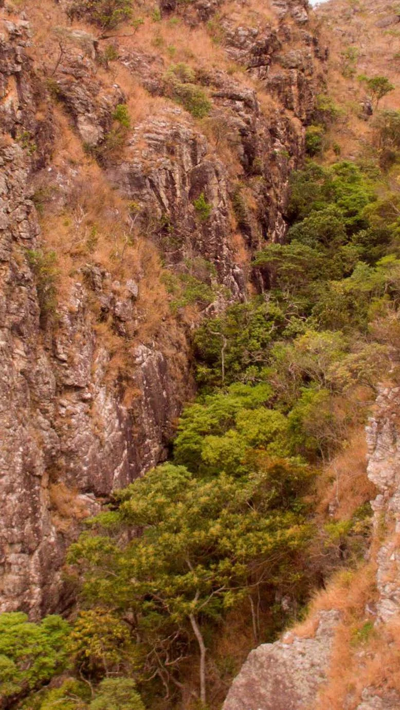

---
nome: Garganta
mapas:
- caminho_imagem_mapa: imagens/setor_garganta_p1.webp
  largura_mapa: 1280
  altura_mapa: 1707
  pontos_de_interesse:
  - id: '01'
    label: '01'
    box:
      x: 948
      y: 986
      comprimento: 43
      largura: 34
  - id: '02'
    label: '02'
    box:
      x: 630
      y: 1069
      comprimento: 45
      largura: 32
  - id: '03'
    label: '03'
    box:
      x: 320
      y: 1060
      comprimento: 45
      largura: 33
  referencias:
  - escalada: Love's in the Air
    ids:
    - '01'
  - escalada: BH em Chamas
    ids:
    - '02'
  - escalada: Revolta dos Vinagres
    ids:
    - '03'
- caminho_imagem_mapa: imagens/setor_garganta_p2.webp
  largura_mapa: 1280
  altura_mapa: 1707
  pontos_de_interesse:
  - id: '04'
    label: '04'
    box:
      x: 612
      y: 1224
      comprimento: 46
      largura: 32
  referencias:
  - escalada: De Pai para Filho
    ids:
    - '04'
- caminho_imagem_mapa: imagens/setor_garganta_p3.webp
  largura_mapa: 1280
  altura_mapa: 1707
  pontos_de_interesse:
  - id: '05'
    label: '05'
    box:
      x: 533
      y: 1248
      comprimento: 44
      largura: 33
  referencias:
  - escalada: Amor de Mãe
    ids:
    - '05'
- caminho_imagem_mapa: imagens/setor_garganta_p4.webp
  largura_mapa: 1280
  altura_mapa: 960
  pontos_de_interesse:
  - id: '06'
    label: '06'
    box:
      x: 1076
      y: 1082
      comprimento: 51
      largura: 42
  - id: '07'
    label: '07'
    box:
      x: 707
      y: 958
      comprimento: 44
      largura: 37
  referencias:
  - escalada: Pagador de Promessa
    ids:
    - '06'
  - escalada: Grande Família
    ids:
    - '07'
- caminho_imagem_mapa: imagens/setor_garganta_p5.webp
  largura_mapa: 1280
  altura_mapa: 960
  pontos_de_interesse:
  - id: '08'
    label: '08'
    box:
      x: 928
      y: 1134
      comprimento: 50
      largura: 37
  - id: '09'
    label: '09'
    box:
      x: 642
      y: 1140
      comprimento: 51
      largura: 45
- caminho_imagem_mapa: imagens/setor_garganta_p6.webp
  largura_mapa: 1280
  altura_mapa: 1707
  pontos_de_interesse:
  - id: '10'
    label: '10'
    box:
      x: 320
      y: 1250
      comprimento: 43
      largura: 33
  - id: '11'
    label: '11'
    box:
      x: 390
      y: 1250
      comprimento: 30
      largura: 29
  - id: '12'
    label: '12'
    box:
      x: 452
      y: 1249
      comprimento: 34
      largura: 30
  - id: '13'
    label: '13'
    box:
      x: 662
      y: 1250
      comprimento: 42
      largura: 33
  referencias:
  - escalada: Guerreiro da Bocaina
    ids:
    - '10'
  - escalada: Samurai Rastafari
    ids:
    - '11'
  - escalada: Ceder Writhe
    ids:
    - '12'
  - escalada: Sai pra Lá Sr. Doutor
    ids:
    - '13'
- caminho_imagem_mapa: imagens/setor_garganta_p7.webp
  largura_mapa: 1280
  altura_mapa: 1707
  pontos_de_interesse:
  - id: '10'
    label: '10'
    box:
      x: 178
      y: 1172
      comprimento: 25
      largura: 23
  - id: '11'
    label: '11'
    box:
      x: 220
      y: 1168
      comprimento: 23
      largura: 22
  - id: '12'
    label: '12'
    box:
      x: 262
      y: 1154
      comprimento: 32
      largura: 25
  - id: '13'
    label: '13'
    box:
      x: 313
      y: 1006
      comprimento: 30
      largura: 25
  - id: '14'
    label: '14'
    box:
      x: 342
      y: 878
      comprimento: 33
      largura: 25
  - id: '15'
    label: '15'
    box:
      x: 362
      y: 697
      comprimento: 33
      largura: 26
  - id: '16'
    label: '16'
    box:
      x: 354
      y: 315
      comprimento: 37
      largura: 30
  referencias:
  - escalada: Guerreiro da Bocaina
    ids:
    - '10'
  - escalada: Samurai Rastafari
    ids:
    - '11'
  - escalada: Ceder Writhe
    ids:
    - '12'
  - escalada: Sai pra Lá Sr. Doutor
    ids:
    - '13'
  - escalada: Maniaco Sexual
    ids:
    - '14'
  - escalada: Paraiboult
    ids:
    - '15'
  - escalada: Mulheres ao Poder
    ids:
    - '16'
- caminho_imagem_mapa: imagens/setor_garganta_p8.webp
  largura_mapa: 1280
  altura_mapa: 1707
  pontos_de_interesse:
  - id: '17'
    label: '17'
    box:
      x: 488
      y: 820
      comprimento: 29
      largura: 25
  - id: '18'
    label: '18'
    box:
      x: 525
      y: 622
      comprimento: 34
      largura: 25
  - id: '19'
    label: '19'
    box:
      x: 592
      y: 720
      comprimento: 32
      largura: 26
  - id: '20'
    label: '20'
    box:
      x: 608
      y: 657
      comprimento: 37
      largura: 28
  - id: '21'
    label: '21'
    box:
      x: 639
      y: 622
      comprimento: 24
      largura: 24
  - id: '22'
    label: '22'
    box:
      x: 686
      y: 623
      comprimento: 26
      largura: 22
  - id: '23'
    label: '23'
    box:
      x: 628
      y: 294
      comprimento: 35
      largura: 29
  referencias:
  - escalada: Invasão Bacteriana
    ids:
    - '17'
  - escalada: Yes We Can
    ids:
    - '18'
  - escalada: Galo Doido
    ids:
    - '19'
  - escalada: Baby Roots
    ids:
    - '20'
  - escalada: Canelinha de Ouro
    ids:
    - '21'
  - escalada: Rei Leão
    ids:
    - '22'
  - escalada: Maluco Beleza
    ids:
    - '23'
- caminho_imagem_mapa: imagens/setor_garganta_p9.webp
  largura_mapa: 1280
  altura_mapa: 1707
  pontos_de_interesse:
  - id: '24'
    label: '24'
    box:
      x: 666
      y: 250
      comprimento: 37
      largura: 28
  - id: '25'
    label: '25'
    box:
      x: 711
      y: 238
      comprimento: 34
      largura: 26
  - id: '26'
    label: '26'
    box:
      x: 804
      y: 410
      comprimento: 34
      largura: 25
  - id: '27'
    label: '27'
    box:
      x: 828
      y: 164
      comprimento: 30
      largura: 25
  - id: '28'
    label: '28'
    box:
      x: 878
      y: 206
      comprimento: 35
      largura: 25
  referencias:
  - escalada: Peter Park
    ids:
    - '24'
  - escalada: Super Poderosa
    ids:
    - '25'
  - escalada: Cinco Vira, Dez Acaba
    ids:
    - '26'
  - escalada: Dunas
    ids:
    - '27'
  - escalada: Poeira Cósmica
    ids:
    - '28'
escaladas:
- via_esportiva:
    nome: Love's in the Air
    dificuldade: BR_6
    extensao: 10
    quantidade_protecoes_intermediarias: 4
    quantidade_protecoes_parada: 2
    conquistadores:
    - Laurêncio Jr
    - Anna Luiza Vilela
    data_abertura: '2015'
- via_esportiva:
    nome: BH em Chamas
    dificuldade: BR_6
    extensao: 10
    quantidade_protecoes_intermediarias: 4
    quantidade_protecoes_parada: 2
    conquistadores:
    - Laurêncio Jr
    - Anna Luiza Vilela
    data_abertura: '2015'
- via_esportiva:
    nome: Revolta dos Vinagres
    dificuldade: BR_6SUP
    extensao: 10
    quantidade_protecoes_intermediarias: 4
    quantidade_protecoes_parada: 2
    conquistadores:
    - Laurêncio Jr
    - Anna Luiza Vilela
    data_abertura: '2015'
- via_esportiva:
    nome: De Pai para Filho
    dificuldade: BR_6
    extensao: 8
    quantidade_protecoes_intermediarias: 2
    quantidade_protecoes_parada: 2
    conquistadores:
    - Daiex de Almeida
    data_abertura: '2016'
- via_esportiva:
    nome: Amor de Mãe
    dificuldade: BR_6
    extensao: 8
    quantidade_protecoes_intermediarias: 3
    quantidade_protecoes_parada: 2
    conquistadores:
    - Daiex de Almeida
    data_abertura: '2016'
- via_esportiva:
    nome: Pagador de Promessa
    dificuldade: BR_6SUP
    extensao: 10
    quantidade_protecoes_intermediarias: 3
    quantidade_protecoes_parada: 2
    conquistadores:
    - Laurêncio Jr
    - Alexandre Fei
    data_abertura: '2013'
- via_esportiva:
    nome: Grande Família
    dificuldade: BR_6
    extensao: 15
    conquistadores:
    - Alexandre Fei
    - Gustavo Maneira
    data_abertura: '2013'
- via_esportiva:
    nome: Sangue do meu Sangue
    dificuldade: BR_6
    extensao: 10
    quantidade_protecoes_intermediarias: 4
    quantidade_protecoes_parada: 2
    conquistadores:
    - Alexandre Fei
    data_abertura: '2013'
- via_esportiva:
    nome: Cocalcinhas
    dificuldade: BR_6
    extensao: 10
    quantidade_protecoes_intermediarias: 4
    quantidade_protecoes_parada: 2
    conquistadores:
    - Alexandre Fei
    data_abertura: '2013'
- via_esportiva:
    nome: Guerreiro da Bocaina
    dificuldade: BR_7A
    extensao: 10
    quantidade_protecoes_intermediarias: 4
    quantidade_protecoes_parada: 2
    conquistadores:
    - Alexandre Fei
    data_abertura: '2013'
- via_esportiva:
    nome: Samurai Rastafari
    dificuldade: BR_7B
    extensao: 10
    quantidade_protecoes_intermediarias: 4
    quantidade_protecoes_parada: 2
    conquistadores:
    - Alexandre Fei
    data_abertura: '2013'
- via_esportiva:
    nome: Ceder Writhe
    dificuldade: BR_8C
    extensao: 12
    quantidade_protecoes_intermediarias: 5
    quantidade_protecoes_parada: 2
    conquistadores:
    - Alexandre Fei
    data_abertura: '2013'
- via_esportiva:
    nome: Sai pra Lá Sr. Doutor
    dificuldade: BR_7A
    extensao: 12
    quantidade_protecoes_intermediarias: 5
    quantidade_protecoes_parada: 2
    conquistadores:
    - Daiex de Almeida
    data_abertura: '2013'
- via_esportiva:
    nome: Maniaco Sexual
    dificuldade: BR_7A
    extensao: 12
    quantidade_protecoes_intermediarias: 4
    quantidade_protecoes_parada: 2
    conquistadores:
    - Alexandre Fei
    data_abertura: '2013'
- via_esportiva:
    nome: Paraiboult
    dificuldade: INDEFINIDO
    extensao: 20
    quantidade_protecoes_intermediarias: 6
    quantidade_protecoes_parada: 2
    conquistadores:
    - Alexandre Fei
    data_abertura: '2013'
- via_esportiva:
    nome: Mulheres ao Poder
    dificuldade: BR_6SUP
    extensao: 30
    quantidade_protecoes_intermediarias: 13
    quantidade_protecoes_parada: 2
    conquistadores:
    - Diego Leonardo
    - Alexandre Fei
    data_abertura: '2013'
- via_esportiva:
    nome: Invasão Bacteriana
    dificuldade: BR_7A
    extensao: 10
    quantidade_protecoes_intermediarias: 5
    quantidade_protecoes_parada: 2
    conquistadores:
    - Alexandre Fei
    data_abertura: '2013'
- via_esportiva:
    nome: Yes We Can
    dificuldade: BR_6SUP
    extensao: 20
    quantidade_protecoes_intermediarias: 7
    quantidade_protecoes_parada: 2
    conquistadores:
    - Alexandre Fei
    data_abertura: '2013'
- via_esportiva:
    nome: Galo Doido
    dificuldade: BR_6SUP
    extensao: 12
    quantidade_protecoes_intermediarias: 6
    quantidade_protecoes_parada: 2
    conquistadores:
    - Alexandre Fei
    data_abertura: '2013'
- via_esportiva:
    nome: Baby Roots
    dificuldade: BR_6SUP
    extensao: 12
    quantidade_protecoes_intermediarias: 4
    quantidade_protecoes_parada: 2
    conquistadores:
    - Juliano Peter
    data_abertura: '2013'
- via_esportiva:
    nome: Canelinha de Ouro
    dificuldade: BR_6
    extensao: 12
    quantidade_protecoes_intermediarias: 4
    quantidade_protecoes_parada: 2
    conquistadores:
    - Alexandre Fei
    data_abertura: '2013'
- via_esportiva:
    nome: Rei Leão
    dificuldade: BR_7A
    extensao: 15
    quantidade_protecoes_intermediarias: 4
    quantidade_protecoes_parada: 2
    conquistadores:
    - Mateus Martins
    - Arthur Martins
    data_abertura: '2013'
- via_esportiva:
    nome: Maluco Beleza
    dificuldade: BR_7B
    conquistadores:
    - Daiex de Almeida
    - Alexandre Fei
    data_abertura: '2013'
- via_esportiva:
    nome: Peter Park
    dificuldade: INDEFINIDO
    extensao: 25
    quantidade_protecoes_intermediarias: 9
    quantidade_protecoes_parada: 2
    conquistadores:
    - Juliano Peter Park
    data_abertura: '2013'
- via_esportiva:
    nome: Super Poderosa
    dificuldade: BR_7A
    extensao: 25
    quantidade_protecoes_intermediarias: 8
    quantidade_protecoes_parada: 2
    conquistadores:
    - Mateus Martins
    - Arthur Martins
    data_abertura: '2013'
- via_esportiva:
    nome: Cinco Vira, Dez Acaba
    dificuldade: BR_6SUP
    extensao: 10
    quantidade_protecoes_intermediarias: 4
    quantidade_protecoes_parada: 2
    conquistadores:
    - Alex
    data_abertura: '2013'
- via_esportiva:
    nome: Dunas
    dificuldade: BR_6SUP
    extensao: 17
    quantidade_protecoes_intermediarias: 7
    quantidade_protecoes_parada: 2
    conquistadores:
    - Alex
    data_abertura: '2013'
- via_esportiva:
    nome: Poeira Cósmica
    dificuldade: BR_7A
    extensao: 15
    quantidade_protecoes_intermediarias: 6
    quantidade_protecoes_parada: 2
    conquistadores:
    - Alex
    data_abertura: '2013'
---
# Setor Garganta

O Setor Garganta é um dos mais icônicos do Bocaina Park, com uma grande concentração de vias de 6º e 7º grau, além da clássica "Ceder Writhe" (8c).

> [!TIP]
> Leve seu lixo e outro que encontrar para a cidade. Não faça necessidades fisiológicas nas trilhas e base de vias. Avisar a administração sobre a abertura de novas vias de escalada. **USE CAPACETE NAS BASES DE VIAS DE ESCALADA.**