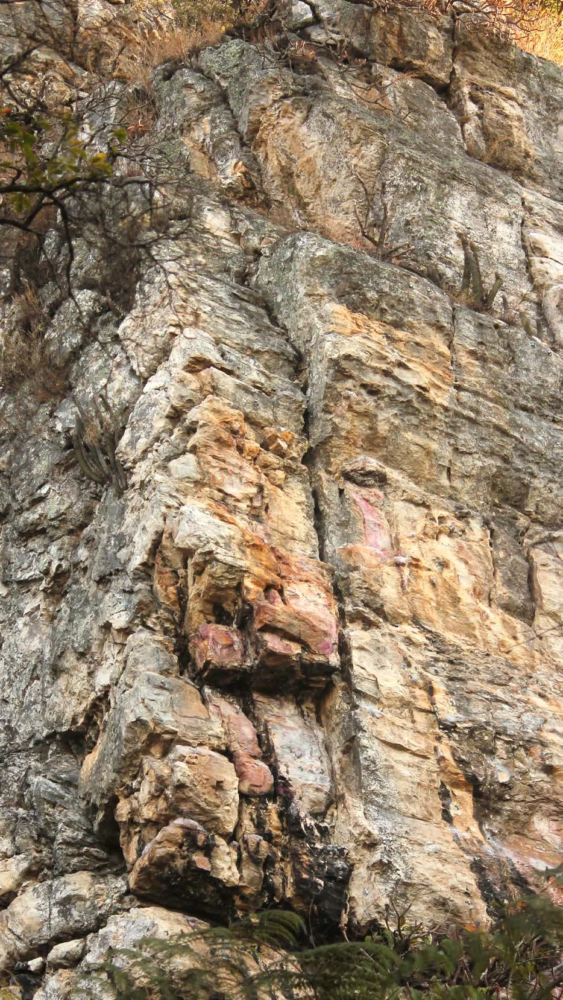

---
nome: Shana Crazy
mapas:
- caminho_imagem_mapa: imagens/setor_shana_crazy_p1.webp
  largura_mapa: 1280
  altura_mapa: 1707
  pontos_de_interesse:
  - id: '01'
    label: '01'
    box:
      x: 365
      y: 1038
      comprimento: 32
      largura: 26
  referencias:
  - escalada: Caroço de Manga
    ids:
    - '01'
- caminho_imagem_mapa: imagens/setor_shana_crazy_p2.webp
  largura_mapa: 1280
  altura_mapa: 1707
  pontos_de_interesse:
  - id: '02'
    label: '02'
    box:
      x: 262
      y: 1223
      comprimento: 41
      largura: 28
  - id: '03'
    label: '03'
    box:
      x: 394
      y: 1223
      comprimento: 39
      largura: 28
  - id: '04'
    label: '04'
    box:
      x: 627
      y: 1244
      comprimento: 42
      largura: 32
  - id: '05'
    label: '05'
    box:
      x: 816
      y: 1169
      comprimento: 43
      largura: 36
  referencias:
  - escalada: Caminho das pedras
    ids:
    - '02'
  - escalada: Caminho das águas
    ids:
    - '03'
  - escalada: Shana Crazy
    ids:
    - '04'
  - escalada: Na racha
    ids:
    - '05'
- caminho_imagem_mapa: imagens/setor_shana_crazy_p3.webp
  largura_mapa: 1280
  altura_mapa: 1707
  pontos_de_interesse:
  - id: '06'
    label: '06'
    box:
      x: 368
      y: 1232
      comprimento: 43
      largura: 33
  - id: '07'
    label: '07'
    box:
      x: 612
      y: 1231
      comprimento: 37
      largura: 30
  - id: '08'
    label: '08'
    box:
      x: 833
      y: 1187
      comprimento: 40
      largura: 28
  - id: '09'
    label: '09'
    box:
      x: 992
      y: 1179
      comprimento: 42
      largura: 32
  referencias:
  - escalada: Lei Rounet
    ids:
    - '06'
  - escalada: Maria da Penha
    ids:
    - '07'
escaladas:
- via_esportiva:
    nome: Caroço de Manga
    dificuldade: BR_4
    extensao: 5
    quantidade_protecoes_intermediarias: 2
    quantidade_protecoes_parada: 2
    conquistadores:
    - Daiex de Almeida
    data_abertura: '2014'
- via_esportiva:
    nome: Caminho das pedras
    dificuldade: BR_5
    extensao: 8
    quantidade_protecoes_intermediarias: 3
    quantidade_protecoes_parada: 2
    conquistadores:
    - Gustavo Maneira
    data_abertura: '2012'
- via_esportiva:
    nome: Caminho das águas
    dificuldade: BR_5
    extensao: 10
    quantidade_protecoes_intermediarias: 4
    quantidade_protecoes_parada: 2
    conquistadores:
    - Diego Leonardo
    data_abertura: '2012'
- via_esportiva:
    nome: Shana Crazy
    dificuldade: BR_6SUP
    extensao: 10
    quantidade_protecoes_intermediarias: 4
    quantidade_protecoes_parada: 2
    conquistadores:
    - Laurêncio
    data_abertura: '2011'
- via_esportiva:
    nome: Na racha
    dificuldade: BR_6SUP
    extensao: 10
    quantidade_protecoes_intermediarias: 4
    quantidade_protecoes_parada: 2
    conquistadores:
    - Pedro Andrade
    data_abertura: '2017'
- via_esportiva:
    nome: Lei Rounet
    dificuldade: BR_7B
    extensao: 10
    quantidade_protecoes_intermediarias: 5
    quantidade_protecoes_parada: 2
    conquistadores:
    - Diego Leonardo
    data_abertura: '2011'
- via_esportiva:
    nome: Maria da Penha
    dificuldade: BR_6SUP
    extensao: 10
    quantidade_protecoes_intermediarias: 4
    quantidade_protecoes_parada: 2
    conquistadores:
    - Laurêncio
    data_abertura: '2011'
- via_esportiva:
    nome: Para-raio de Maluco
    dificuldade: BR_6
    extensao: 12
    quantidade_protecoes_intermediarias: 7
    quantidade_protecoes_parada: 2
    conquistadores:
    - Diego Leonardo
    - Gustavo Maneira
    data_abertura: '2011'
- via_esportiva:
    nome: Sandálias da Humildade
    dificuldade: BR_7B
    extensao: 10
    quantidade_protecoes_intermediarias: 7
    quantidade_protecoes_parada: 2
    conquistadores:
    - Diego Leonardo
    data_abertura: '2011'
---
# Setor Shana Crazy

O Setor Shana Crazy possui vias curtas e intensas, variando do 4º ao 7º grau.

> [!TIP]
> Leve seu lixo e outro que encontrar para a cidade. Não faça necessidades fisiológicas nas trilhas e base de vias. Avisar a administração sobre a abertura de novas vias de escalada. **USE CAPACETE NAS BASES DE VIAS DE ESCALADA.**