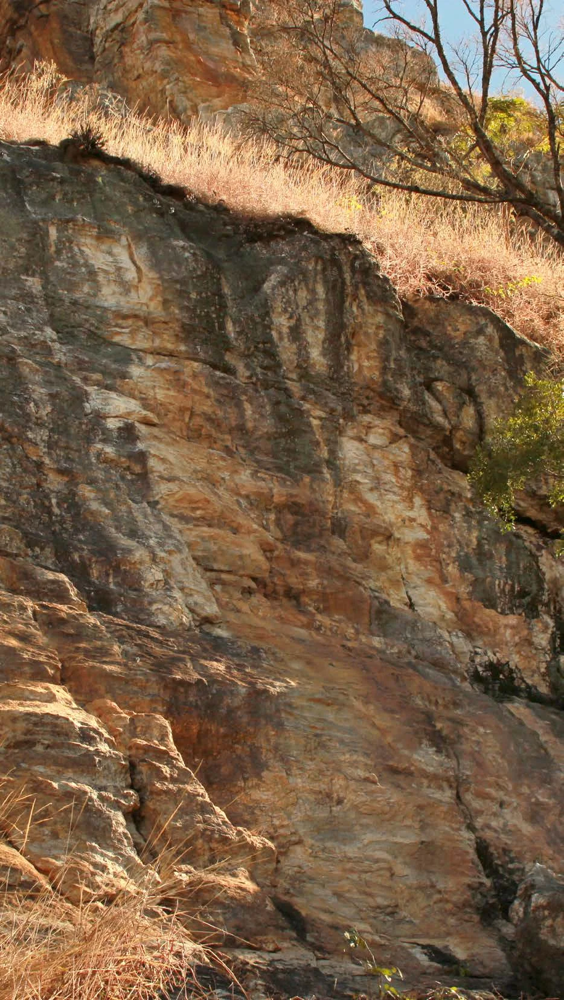

# Setor Tapa na Cara

Setor com vias curtas e técnicas, ideal para quem busca vias de 6º e 7º grau.

> [!TIP]
> Leve seu lixo e outro que encontrar para a cidade. Não faça necessidades fisiológicas nas trilhas e base de vias. Avisar a administração sobre a abertura de novas vias de escalada. **USE CAPACETE NAS BASES DE VIAS DE ESCALADA.**