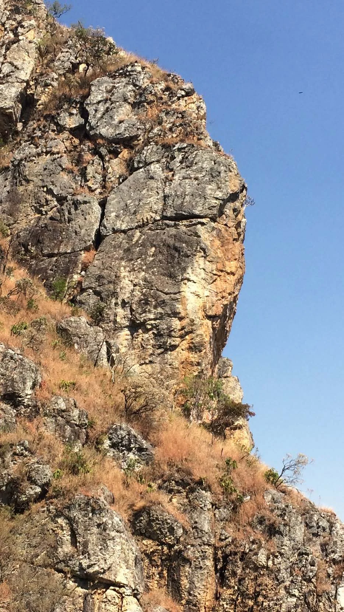

# Setor Terceiro Andar

O Setor Terceiro Andar é conhecido por suas vias de alta dificuldade, incluindo projetos e vias de 9º grau consolidado.

> [!TIP]
> Leve seu lixo e outro que encontrar para a cidade. Não faça necessidades fisiológicas nas trilhas e base de vias. Avisar a administração sobre a abertura de novas vias de escalada. **USE CAPACETE NAS BASES DE VIAS DE ESCALADA.**