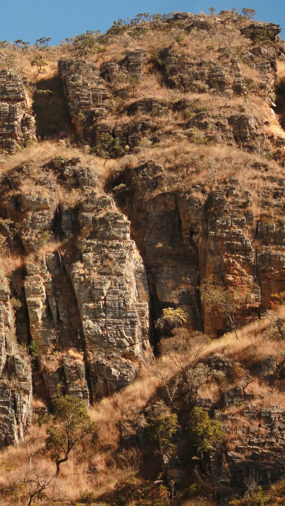

---
nome: Udão
mapas:
- caminho_imagem_mapa: imagens/setor_udao_p1.webp
  largura_mapa: 1280
  altura_mapa: 1707
  pontos_de_interesse:
  - id: '01'
    label: '01'
    box:
      x: 223
      y: 1090
      comprimento: 30
      largura: 27
  - id: '02'
    label: '02'
    box:
      x: 274
      y: 1084
      comprimento: 33
      largura: 27
  - id: '03'
    label: '03'
    box:
      x: 340
      y: 1088
      comprimento: 41
      largura: 29
  - id: '04'
    label: '04'
    box:
      x: 570
      y: 952
      comprimento: 44
      largura: 33
  - id: '05'
    label: '05'
    box:
      x: 622
      y: 900
      comprimento: 43
      largura: 34
  - id: '06'
    label: '06'
    box:
      x: 668
      y: 854
      comprimento: 45
      largura: 34
  referencias:
  - escalada: Pulando a cerca
    ids:
    - '01'
  - escalada: Cerca Elétrica
    ids:
    - '02'
  - escalada: Clube da Esquina
    ids:
    - '03'
  - escalada: Chuva de Meteoros
    ids:
    - '04'
  - escalada: Pit Bitoca
    ids:
    - '05'
  - escalada: Jovem Ganso
    ids:
    - '06'
  - escalada: Filho de Vó
    ids:
    - '07'
  - escalada: Loucura Alheia
    ids:
    - '8'
  - escalada: Mistério de Ramadã
    ids:
    - '9'
  - escalada: Chuva de Verão
    ids:
    - '10'
  - escalada: Pole Dance
    ids:
    - '11'
  - escalada: Brusqueta do Cerrado
    ids:
    - '12'
  - escalada: Rota Aérea
    ids:
    - '13'
- caminho_imagem_mapa: imagens/setor_udao_p2.webp
  largura_mapa: 1280
  altura_mapa: 1707
  pontos_de_interesse:
  - id: '07'
    label: '07'
    box:
      x: 702
      y: 808
      comprimento: 31
      largura: 25
  - id: 08
    label: 08
    box:
      x: 745
      y: 784
      comprimento: 32
      largura: 26
  - id: 09
    label: 09
    box:
      x: 787
      y: 814
      comprimento: 34
      largura: 23
  - id: '10'
    label: '10'
    box:
      x: 831
      y: 799
      comprimento: 34
      largura: 24
  - id: '11'
    label: '11'
    box:
      x: 884
      y: 772
      comprimento: 41
      largura: 36
  - id: '12'
    label: '12'
    box:
      x: 947
      y: 740
      comprimento: 42
      largura: 32
  - id: '13'
    label: '13'
    box:
      x: 1000
      y: 715
      comprimento: 42
      largura: 32
escaladas:
- via_esportiva:
    nome: Pulando a cerca
    dificuldade: BR_6SUP
    extensao: 12
    quantidade_protecoes_intermediarias: 6
    quantidade_protecoes_parada: 2
    conquistadores:
    - Alexandre Fei
    - Daiex
    data_abertura: '2014'
- via_esportiva:
    nome: Cerca Elétrica
    dificuldade: BR_7A
    extensao: 15
    quantidade_protecoes_intermediarias: 5
    quantidade_protecoes_parada: 2
    conquistadores:
    - Alexandre Fei
    data_abertura: '2013'
- via_esportiva:
    nome: Clube da Esquina
    dificuldade: BR_5
    extensao: 8
    quantidade_protecoes_intermediarias: 3
    quantidade_protecoes_parada: 2
    conquistadores:
    - Gustavo Maneira
    - Daiex de Almeida
    data_abertura: '2013'
- via_esportiva:
    nome: Chuva de Meteoros
    dificuldade: BR_6
    extensao: 25
    quantidade_protecoes_intermediarias: 7
    quantidade_protecoes_parada: 2
    conquistadores:
    - Daiex de Almeida
    data_abertura: '2013'
- via_esportiva:
    nome: Pit Bitoca
    dificuldade: BR_6SUP
    extensao: 18
    quantidade_protecoes_intermediarias: 5
    quantidade_protecoes_parada: 2
    conquistadores:
    - Alexandre Fei
    data_abertura: '2013'
- via_esportiva:
    nome: Jovem Ganso
    dificuldade: BR_6SUP
    extensao: 15
    quantidade_protecoes_intermediarias: 6
    quantidade_protecoes_parada: 2
    conquistadores:
    - Daiex de Almeida
    - Gustavo Maneira
    data_abertura: '2013'
- via_esportiva:
    nome: Filho de Vó
    dificuldade: BR_6SUP
    extensao: 12
    quantidade_protecoes_intermediarias: 4
    quantidade_protecoes_parada: 2
    conquistadores:
    - Daiex de Almeida
    - Gustavo Maneira
    data_abertura: '2013'
- via_esportiva:
    nome: Loucura Alheia
    dificuldade: BR_6SUP
    extensao: 12
    quantidade_protecoes_intermediarias: 4
    quantidade_protecoes_parada: 2
    conquistadores:
    - Daiex de Almeida
    - Gustavo Maneira
    data_abertura: '2013'
- via_esportiva:
    nome: Mistério de Ramadã
    dificuldade: BR_7A
    extensao: 15
    quantidade_protecoes_intermediarias: 6
    quantidade_protecoes_parada: 2
    conquistadores:
    - Alexandre Fei
    - Gustavo Maneira
    data_abertura: '2013'
- via_esportiva:
    nome: Chuva de Verão
    dificuldade: BR_7A
    extensao: 12
    quantidade_protecoes_intermediarias: 5
    quantidade_protecoes_parada: 2
    conquistadores:
    - Alexandre Fei
    data_abertura: '2013'
- via_esportiva:
    nome: Pole Dance
    dificuldade: BR_6SUP
    extensao: 12
    quantidade_protecoes_intermediarias: 5
    quantidade_protecoes_parada: 2
    conquistadores:
    - Alexandre Fei
    data_abertura: '2013'
- via_esportiva:
    nome: Brusqueta do Cerrado
    dificuldade: BR_6
    extensao: 8
    quantidade_protecoes_intermediarias: 5
    quantidade_protecoes_parada: 2
    conquistadores:
    - Daiex de Almeida
    data_abertura: '2016'
- via_esportiva:
    nome: Rota Aérea
    dificuldade: BR_6
    extensao: 8
    quantidade_protecoes_intermediarias: 4
    quantidade_protecoes_parada: 2
    conquistadores:
    - Gustavo
    data_abertura: '2016'
---
# Setor Udão

O Setor Udão apresenta vias de 5º a 7º grau, com uma boa concentração de vias de 6º sup.

> [!TIP]
> Leve seu lixo e outro que encontrar para a cidade. Não faça necessidades fisiológicas nas trilhas e base de vias. Avisar a administração sobre a abertura de novas vias de escalada. **USE CAPACETE NAS BASES DE VIAS DE ESCALADA.**