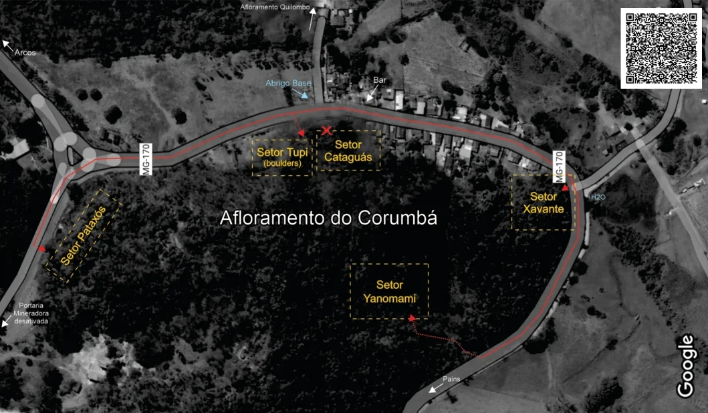

# Mapas Gerais

## Mapa dos Afloramentos da Regional

## Mapa dos Setores - Comunidade Corumbá/MG

### Informações de Acesso

- **Localização:** O afloramento de calcário do **Corumbá** fica literalmente atrás das casas da Pequena Comunidade Corumbá; está localizada às margens da MG-170 que liga os municípios de Arcos e Pains - MG.
- **Ponto de referência:** O afloramento fica em frente ao **Abrigo Base** (abrigo, refúgio e camping de escalada).
- **Link Google Maps:** [Corumbá Climb](https://maps.app.goo.gl/kyRAVySvQXDD47uB9)

### Recomendações e Segurança

- É imprescindível o **USO DE CAPACETE** (escalador, "segue" e pessoas nas bases das vias) pode haver possíveis pedras soltas.
- Cuidado com abelhas, marimbondos e animais peçonhentos.
- Utilize cordas de **60 metros** ou mais.
- **ATENÇÃO:** Devido à proximidade das vias/setores com as casas da comunidade e rodovia, **RESPEITE!**