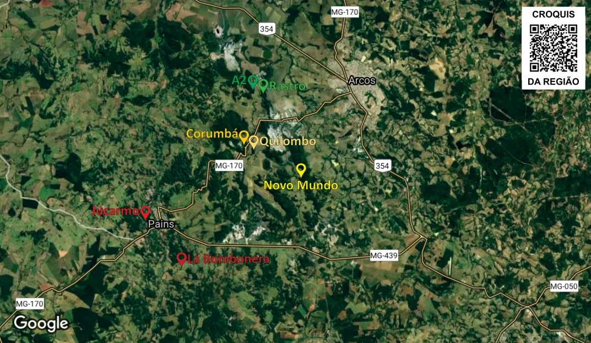
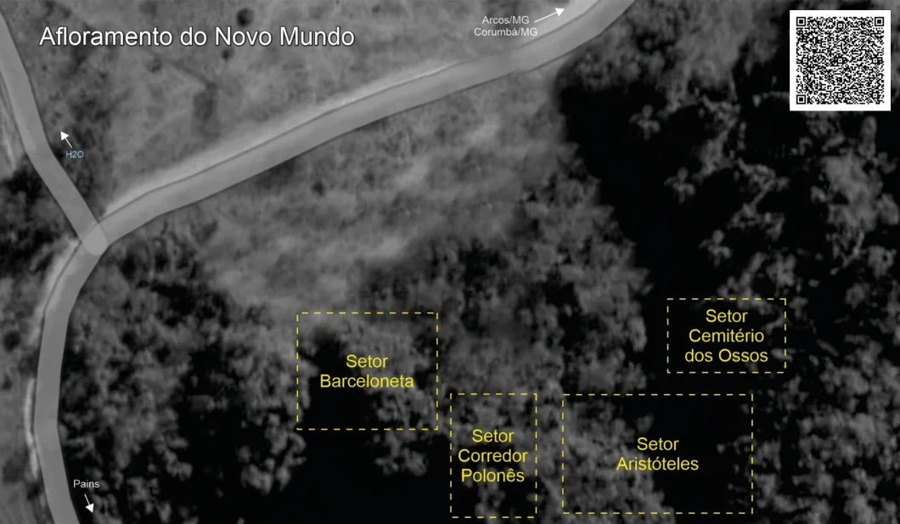

# Mapas Gerais

## Mapa dos Afloramentos da Regional

## Mapa de Setores

**RECOMENDAÇÕES:** É imprescindível o **USO DE CAPACETE** (escalador, "segue" e pessoas nas bases das vias) pode haver possíveis pedras soltas; cuidado com abelhas, marimbondos e animais peçonhentos; Utilize cordas de 60 metros ou mais.

**COMO CHEGAR:** O afloramento de calcário do **Novo Mundo** fica na estrada dos fazendeiros, logo após a mineradora (que está dos dois lados da estrada), no sentido município de Arcos a Pains - MG.

**ATENÇÃO:** aos horários de explosão da mineradora - geralmente de **11h30 e 17h15** (de acordo com as placas).

Novo Mundo Climb: <https://maps.app.goo.gl/NH7WxKaFaBwgPk5CA>