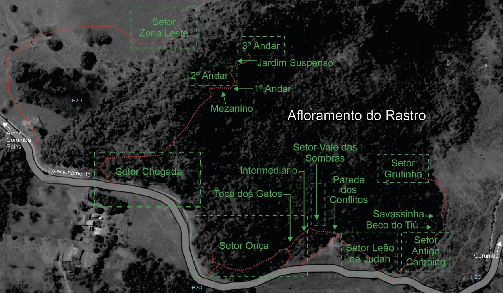

# Mapas Gerais

## Mapa dos Afloramentos da Regional
Neste mapa é possível visualizar a localização do Afloramento Rastro em relação aos outros picos da região de Arcos e Pains.

## Mapa dos Setores
Este mapa detalha a localização de cada setor no Afloramento Rastro, bem como o estacionamento e os pontos de água (H2O).

### Recomendações e Informações
- É imprescindível o **USO DE CAPACETE** (escalador, "segue" e pessoas nas bases das vias) pode haver possíveis pedras soltas; cuidado com abelhas, marimbondos e animais peçonhentos; Utilize cordas de 60 metros ou mais.
- **COMO CHEGAR**: O afloramento de calcário do **Rastro** fica a 8km do município de Arcos (chegando no setor da Chegada); outro acesso é do Corumbá ao Rastro (3km) chegando no setor do Camping Antigo.
- **ATENÇÃO**: em ambos estacionar de forma a não atrapalhar a passagem/porteiras dos locais (carros, charretes, gado, etc.). no segundo atravessa o córrego em trilha sobre as pedras colocadas.