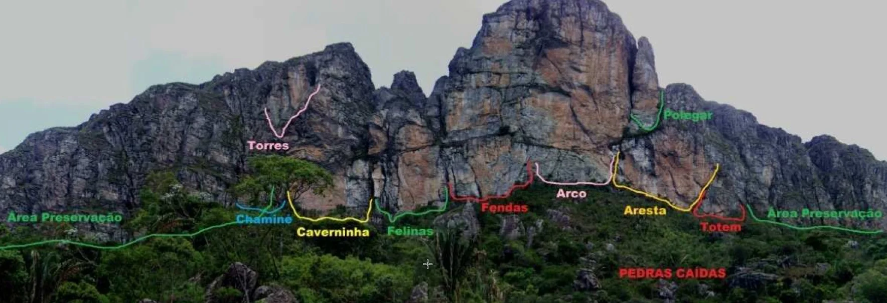

# Mapas Gerais

## Visão Geral dos Setores

O complexo de escalada de Cambotas é dividido nos seguintes setores principais:
- Torres
- Chaminé
- Caverninha
- Felinas
- Fendas
- Arco
- Polegar
- Aresta
- Totem