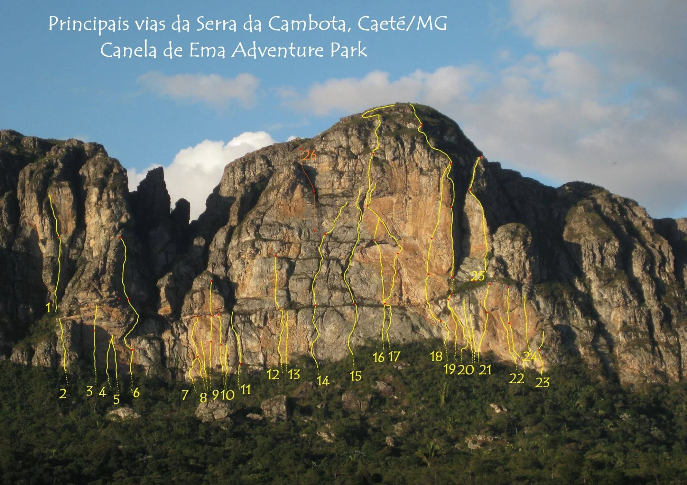

---
nome: Caverninha
mapas:
- caminho_imagem_mapa: imagens/setor_caverninha_p0_i0.webp
  referencias:
  - escalada: Princesa léia
    ids:
    - '31'
  - escalada: Double trouble
    ids:
    - '32'
  - escalada: Supurados
    ids:
    - '33'
  - escalada: O doce e o amargo
    ids:
    - '34'
escaladas:
- via_movel:
    nome: Princesa léia
    dificuldade: BR_7A
    extensao: 40
    conquistadores:
    - Antonio Canelas
    - Elaine
    descricao: Ótima via em fendas e agarras. Crux protegido com grampos. Começa em cima da caverninha usada como abrigo. Peças pequenas e médias.
- via_multiplas_enfiadas:
    nome: Double trouble
    dificuldade_maxima: BR_7B
    exposicao: E3
    numero_enfiadas: 3
    tipo_via_multiplas_enfiadas: MISTA
    conquistadores:
    - André Coutinho
    - Breno Araújo
    descricao: Começa no final da 'princesa léia'. Exige boa leitura de via e domínio da técnica móvel. Terceira enfiada exposta. Peças médias e grandes.
    comprimento_total: 80
- via_movel:
    nome: Supurados
    dificuldade: INDEFINIDO
    extensao: 30
    conquistadores:
    - André Coutinho
    - Breno Araújo
    descricao: Via mista muito interessante. Possui belas fendas em rocha muito sólida. Peças pequenas e médias. Crux protegido com chapeletas.
- via_esportiva:
    nome: O doce e o amargo
    dificuldade: BR_9A
    extensao: 60
    conquistadores:
    - Breno Araújo
    - Gustavo Vianna
    descricao: Talvez a via mai difícil da parede. Crux ainda não foi isolado. Tem um teto espetacular na parte final da via. Muito bonita!
---

# Setor Caverninha

O setor Caverninha possui algumas das vias mais desafiadoras e interessantes do complexo, incluindo a via "O doce e o amargo".

