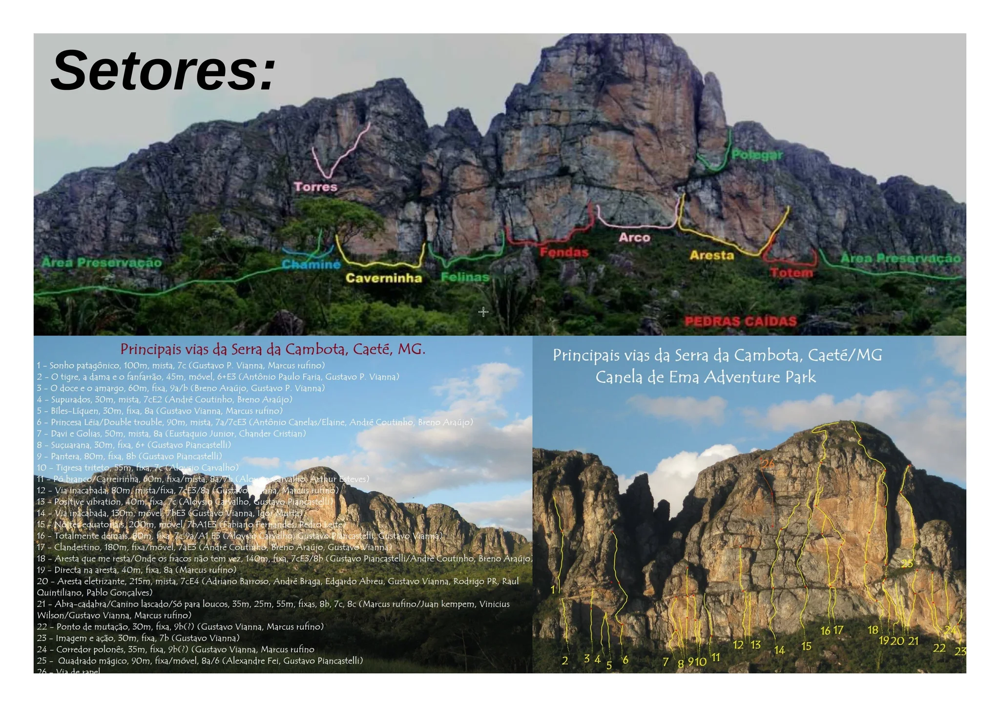

---
nome: Totem
mapas:
- caminho_imagem_mapa: imagens/setor_totem_p1.webp
  referencias:
  - escalada: Quebra cabeça
    ids:
    - '1'
  - escalada: Imagem e ação
    ids:
    - '2'
escaladas:
- via_esportiva:
    nome: Quebra cabeça
    dificuldade: BR_6SUP
    exposicao: E3
    extensao: 20
    conquistadores:
    - Gustavo Vianna
    - Tatiana Mascarenhas
    descricao: Via perigosa, muitas pontas quebradiças. Usar fitas longas. Molha em época de chuvas. Usa-se o top da 'imagem e ação'.
- via_esportiva:
    nome: Imagem e ação
    dificuldade: BR_7B
    extensao: 20
    conquistadores:
    - Gustavo Vianna
    - Tatiana Mascarenhas
    descricao: Linda via. Escalada bastante estética em aresta negativa. Proporciona belas imagens. Top equipado com mosquetões de aço para desequipagem da via.
---

# Setor Totem

O setor Totem é uma formação isolada com vias técnicas e estéticas.

