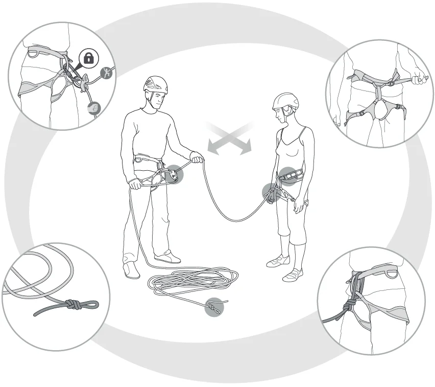

# AVISO

Não faça uso deste croqui de escalada sem ler e concordar com os termos descritos abaixo.

A escalada é um esporte que exige treinamento prévio, quando realizada sem conhecimento técnico adequado, pode resultar em ferimentos graves, paralisia e/ou morte. Portanto este croqui não autoriza, sob qualquer hipótese, a prática de escalada sem a orientação ou treinamento realizado por um profissional credenciado e reconhecido pela comunidade.

Este croqui serve apenas como um material de referência para os escaladores que já possuem habilidades no esporte. Se você não possui treinamento adequado, não faça uso deste croqui. Este croqui não é dedicado a escaladores inexperientes, sem conhecimento e/ou domínio das técnicas de escalada.

Por se tratar de um novo local é imprescindível o uso de capacete.

# SEGURANÇA

**Antes de começar a escalar verifique:**

1 - Verifique se os mosquetões do freio de segurança estão fechados e travados.
2 - Verifique se o freio de segurança está montado corretamente.
3 - Verifique se a cadeirinha está ajustada e afivelada corretamente.
4 - Verifique se o nó de escalada está correto e passando nas alças das pernas e cintura da cadeirinha.
5 - Faça o nó arremate na ponta da corda.
6 - Utilize sempre capacete.

# TELEFONES ÚTEIS

SAMU: 192
Corpo de bombeiros: 193
Pronto socorro municipal: (35) 3435-3374
Hospital São Lucas: (35) 3100-9550
Informações turísticas: (35) 3435-3711