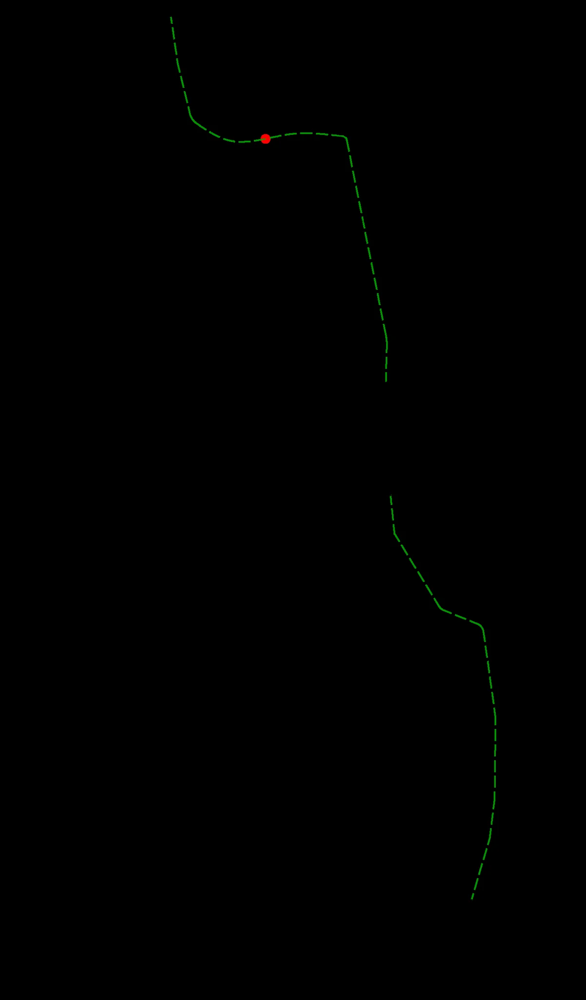
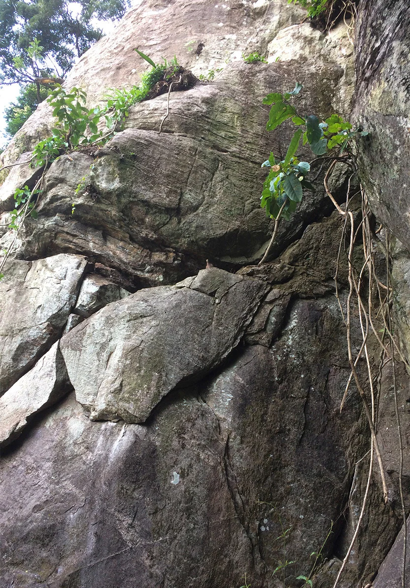
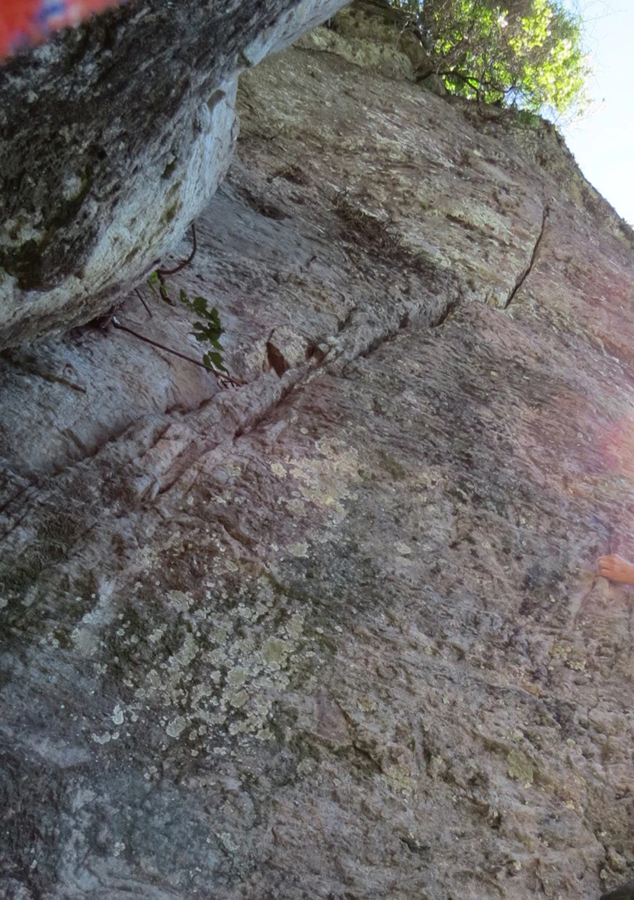

---
nome: Headwall
mapas:
- caminho_imagem_mapa: imagens/setor_headwall_p0_i0.webp
escaladas:
- via_movel:
    nome: Arthropoda
    dificuldade: BR_6SUP
    exposicao: E2
    extensao: 60
    quantidade_protecoes_intermediarias: 10
    conquistadores:
    - Jorge Lima
    - Tico
    - André Morales
    - Juvenil Lino
    protecoes_moveis: Camalot(.4, .5, .75, 1, 2) ou compatíveis
    descricao: 'Obs: Abelhas próximo a via, utilizar costuras longas.'
- via_movel:
    nome: Atratus Death
    dificuldade: BR_6SUP
    extensao: 50
    quantidade_protecoes_intermediarias: 9
    conquistadores:
    - Jorge Lima
    - João Biskui
    - Leandro Schin
    - Aline Tavares
    protecoes_moveis: Nut 5 (Início da via) ou compatível.
    descricao: 'Obs: Na ausência de peça móvel utilizar clip stick na saída.'
- via_movel:
    nome: Fenda do Café
    dificuldade: BR_6SUP
    extensao: 40
    quantidade_protecoes_intermediarias: 2
    conquistadores:
    - Jorge Lima
    - Anthony Hirata
    - Bruno Tebet
    protecoes_moveis: Camalot(1, 2, 2, 3, 4, 5, 6) ou compatíveis
    descricao: 'Obs: Utilizar costuras longas, parada em móvel podendo equalizar em três pontos.
      O rapel pode ser feito na parada da via ao lado.'
- via_esportiva:
    nome: Taj Mahola
    dificuldade: BR_4SUP
    extensao: 25
    quantidade_protecoes_intermediarias: 4
    conquistadores:
    - André Morales
    - Jorge Lima
    - Tico
- via_movel:
    nome: Apertadinha
    dificuldade: BR_6SUP
    extensao: 60
    quantidade_protecoes_intermediarias: 2
    conquistadores:
    - Zé Ricardo
    - Jorge Lima
    protecoes_moveis: Camalot(.4, .5, .75, 1, 2, 3, 4, 5) ou compatíveis; Nuts (1 a 5, 10)
      ou compatíveis
    descricao: 'OBSERVAÇÕES: Atenção com esticão do final da fenda até a parada.'
---

