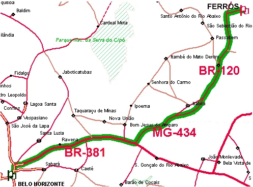

# Como Chegar

**De Carro:**

Saindo de BH, pegue a BR-262 em direção à Vitória. Vire à esquerda no trevo entre Vitória e Itabira, direção Itabira. Mais adiante, no trevo entre Itabira e Santa Maria do Itabira, pegue à direita, em direção a esta última cidade. No antigo bar “Parada Certa”, que fica a cerca de 20 km de Santa Maria do Itabira, pode-se seguir pelo asfalto em direção ao trevo de Ferros, ou pegar um caminho mais curto, com mais estrada de terra, evitando passar pela cidade. Do centro de Ferros até a área de escaladas, siga o mapa na próxima página. O trajeto total possui cerca de 190 quilômetros, feitos em aproximadamente 3 horas.

**De ônibus:**

Pegar o ônibus da viação SARITUR, na rodoviária de BH, com destino a Ferros (valor em março de 2018: R$60). A viagem dura em torno de quatro horas.

Chegando em Ferros, é fácil conseguir um táxi com corrida combinada, por aproximadamente R$50,00, para percorrer os 11 Km do centro da cidade à área propícia para camping, próxima à base das escaladas. Lembre-se de combinar com o taxista a corrida de retorno!

