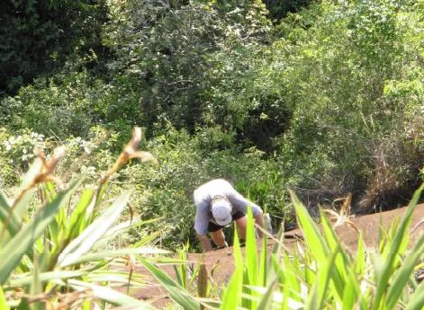

# A Parede das Aderências

Ao entrar no vale do Roncador, o excursionista terá à sua esquerda a Parede das Aderências, de dimensões mais reduzidas do que a Parede Principal e com vias predominantemente em aderência - como o próprio nome sugere – variando de 20 a 230 metros de extensão.

As vias mais longas apresentam grau geral 3º, à exceção da via “Solamente”, paredão com 120 metros, em 1º II, conquistada em solo integral pelo Tonico. Os graus específicos mais frequentes ficam entre IV e V (crux), havendo uma via curta de VIIa (“Ferro na Boneca” – 20m) e outra mista, em VI (“O Psicopata de Ferros”).

Dentre suas vias, destacam-se a “Cordeiro de Deus” (V – 60m), “O Psicopata de Ferros” (4° VI E2 D1 – 70m – Mista), “Cinquentona de Ferros” (IIIsup – 60m), “Grampos de Ferros” (3º IVsup – 110m) e “Social Club” (3º IIIsup – 200m), vias que, em seu conjunto, permitem um bom conhecimento desse trecho do vale.

Este setor é imperdível para aqueles que apreciam a técnica de aderência, bem como aos que estão necessitando de treino na referida. Apesar das poucas agarras, a aderência da pedra é impressionante, conferindo muita confiança ao escalador.

Curiosamente, algumas destas vias possuem também proteções mistas, ou seja, intercalando grampos fixos e materiais móveis.