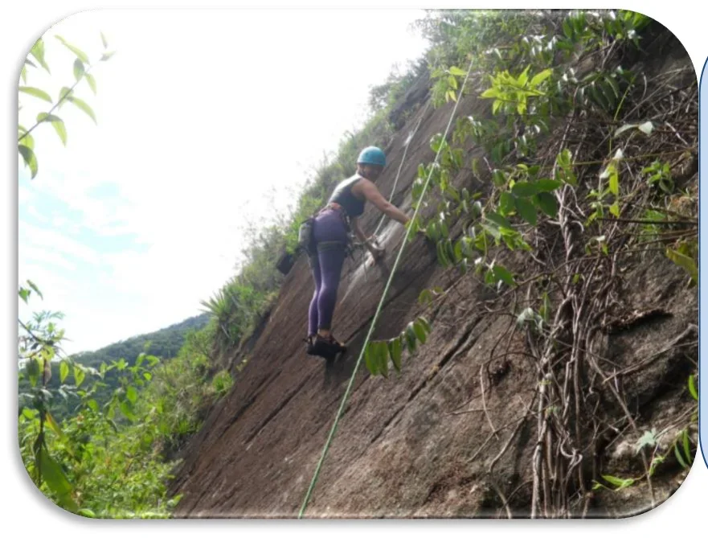
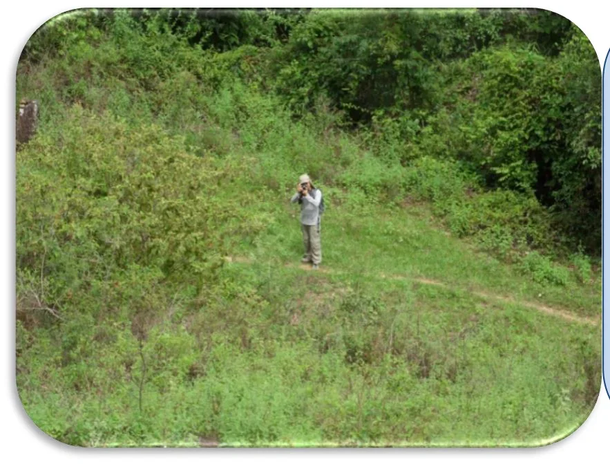

<small>Capa: Pedro Bugim na conquista da "O Psicopata de Ferros" (Foto: Maria Fernanda)</small>

O Setor Esquerdo da Parede das Aderências é dividido em duas partes (Esquerda 1 e Esquerda 2), separadas por uma forte língua de vegetação, possuindo vias de 20 até 140 metros de extensão, predominantemente em aderência.

Apesar do setor ser predominantemente de aderência, três vias destoam das demais, sendo quase que completamente em móvel (“Fissurim”, “O Psicopata de Ferros” e “Vr. Caçadora de Micuim”), seguindo por bonitas fendas, proporcionando ao escalador um bom treino desta técnica.

## Acesso

O acesso às bases é feito pela trilha principal do Vale do Roncador. Após a primeira travessia do córrego, anda-se aproximadamente 100 metros até encontrar – à esquerda - a entrada da picada que leva às bases das primeiras vias neste setor (“Cordada 171”, “Inês é Morta” e “Sempre Viva”), logo antes de passar por uma porteira. Esta trilha, apesar de pouco visível, está marcada com um totem de pedra em seu início.

Para as demais vias da parte esquerda deste setor, basta continuar por poucos metros na trilha principal, uma vez que as bases saem quase diretamente desta trilha.

Para acessar as bases do setor da direita, segue-se por aproximadamente 80 metros na trilha principal até encontrar a picada que sobe à esquerda. Desta picada, pode-se costear a parede, seguindo por cima ou para baixo, com imediata visualização dos grampos das vias “Frio na Barriga” e “Pescoço de Minhoca”.

### Esquema de Trilhas

- **1**: Base das vias “Cordada 171”, “Inês é Morta” e “Sempre Viva”
- **2**: Base das vias entre “Fissurim” e “Sherlock Holmes”
- **3**: Base das vias entre “Professor Moriarty” e “O Psicopata de Ferros”
- **4**: Base das vias “Frio na Barriga” e “Pescoço de Minhoca”
- **5**: Base das vias “Grampos de Ferros” e “Prateado”

