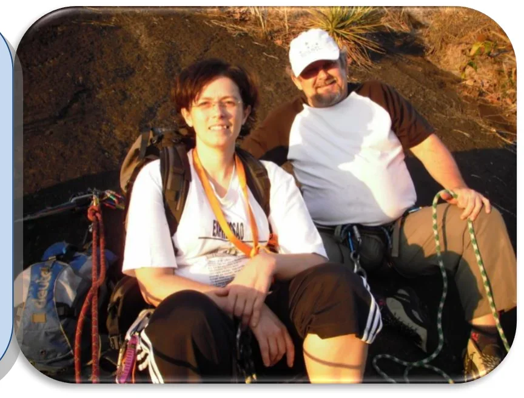

<small>Capa: Celso e Tonico na conquista da "Elementar, Meu Caro Watson!" (Foto: Pedro Bugim)</small>

A parede central das aderências concentra a maioria das vias longas deste lado do vale, com linhas de até 200 metros.

Como o próprio nome sugere, a maioria esmagadora das vias neste setor são predominantemente em aderência, com poucas agarras e buracos, porém, o abrasivo granito confere ao escalador uma ótima confiança nos pés.

O acesso às bases é realizado pela trilha principal do Vale do Roncador, passando pelo setor das Aderências – Esquerda e seguindo por mais aproximadamente 200 metros. A trilha para as bases encontra-se imediatamente antes da segunda travessia do córrego, à esquerda (de quem está entrando no vale). Neste ponto, é possível também, recarregar os cantis de água, antes e após as escaladas.

A trilha sobe por poucos metros e chega à base das vias “Cordeiro de Deus” e “Cinquentona de Ferros”. Para acessar as bases das vias adjacentes, basta costear a parede, para a esquerda ou direita, seguindo sempre pela picada bem definida.

Para as vias entre a “Vr. Esquibunda” e “Pavão Misterioso”, a trilha começa cerca de 50 metros antes da travessia do córrego, à esquerda, onde possui um totem de pedra indicando a entrada da picada.

