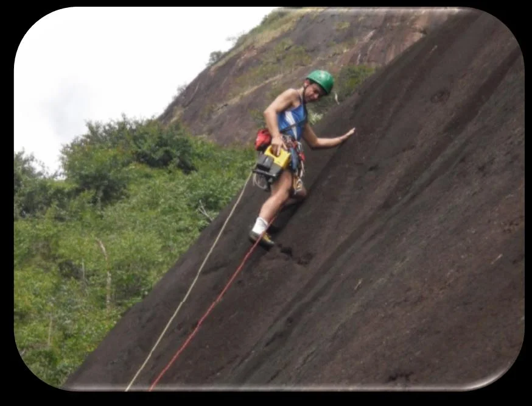

---
nome: Parede Principal – Setor Central
mapas:
- caminho_imagem_mapa: imagens/grupo_principal_setor_central_p1_i0.webp
  referencias:
  - escalada: Ferro no Judas
    ids:
    - '1'
  - escalada: Marcado a Ferro
    ids:
    - '2'
  - escalada: Rolam as Pedras
    ids:
    - '3'
  - escalada: Pum Medonho
    ids:
    - '6'
  - escalada: Pr. Chapado
    ids:
    - '7'
  - escalada: Dona Flor e Suas Duas Marretas
    ids:
    - '8'
  - escalada: Pé de Pano
    ids:
    - '9'
  - escalada: Eu Sei o Que Vocês Fizeram no Blackout Passado
    ids:
    - '11'
  - escalada: Hilda Furacão
    ids:
    - '12'
  - escalada: Iron Men
    ids:
    - '13'
  - escalada: Rainha da Base
    ids:
    - '15'
  - escalada: A Ferro e Fogo
    ids:
    - '16'
  - escalada: Chuva Ácida
    ids:
    - '17'
  - escalada: A Decadência da Bufa
    ids:
    - '18'
  - escalada: Tatu do Jeca
    ids:
    - '19'
  - escalada: Jeca Tatu
    ids:
    - '20'
  - escalada: Valeu Papito
    ids:
    - '21'
  - escalada: Macambúzio
    ids:
    - '23'
  - escalada: Tromba D’Água
    ids:
    - '4'
  - escalada: Ferro Velho
    ids:
    - '5'
  - escalada: CDF
    ids:
    - '10'
  - escalada: Cordão do Bola Preta
    ids:
    - '14'
- caminho_imagem_mapa: imagens/grupo_principal_setor_central_p2_i0.webp
escaladas:
- via_esportiva:
    nome: Ferro no Judas
    dificuldade: BR_5SUP
    extensao: 130
- via_esportiva:
    nome: Marcado a Ferro
    dificuldade: BR_5
    extensao: 180
- via_esportiva:
    nome: Rolam as Pedras
    dificuldade: BR_4
    exposicao: E1
    extensao: 130
- via_movel:
    nome: Tromba D’Água
    dificuldade: BR_4
    exposicao: E3
    extensao: 175
- via_movel:
    nome: Ferro Velho
    dificuldade: BR_4
    exposicao: E2
    extensao: 140
- via_esportiva:
    nome: Pum Medonho
    dificuldade: BR_3SUP
    extensao: 110
- via_esportiva:
    nome: Pr. Chapado
    dificuldade: BR_4
    exposicao: E1
    extensao: 135
- via_esportiva:
    nome: Dona Flor e Suas Duas Marretas
    dificuldade: BR_3SUP
    exposicao: E2
    extensao: 130
- via_esportiva:
    nome: Pé de Pano
    dificuldade: BR_4
    exposicao: E1
    extensao: 150
- via_movel:
    nome: CDF
    dificuldade: BR_4
    extensao: 130
- via_esportiva:
    nome: Eu Sei o Que Vocês Fizeram no Blackout Passado
    dificuldade: BR_4SUP
    exposicao: E1
    extensao: 115
- via_esportiva:
    nome: Hilda Furacão
    dificuldade: BR_4
    extensao: 165
- via_esportiva:
    nome: Iron Men
    dificuldade: BR_5
    extensao: 160
- via_movel:
    nome: Cordão do Bola Preta
    dificuldade: BR_4SUP
    exposicao: E2
    extensao: 130
- via_esportiva:
    nome: Rainha da Base
    dificuldade: BR_4SUP
    exposicao: E2
    extensao: 120
- via_esportiva:
    nome: A Ferro e Fogo
    dificuldade: BR_4
    extensao: 150
- via_esportiva:
    nome: Chuva Ácida
    dificuldade: BR_3SUP
    exposicao: E1
    extensao: 50
- via_esportiva:
    nome: A Decadência da Bufa
    dificuldade: BR_4SUP
    exposicao: E1
    extensao: 125
- via_esportiva:
    nome: Tatu do Jeca
    dificuldade: BR_3SUP
    exposicao: E1
    extensao: 30
- via_esportiva:
    nome: Jeca Tatu
    dificuldade: BR_4SUP
    extensao: 90
- via_esportiva:
    nome: Valeu Papito
    dificuldade: BR_3SUP
    extensao: 90
- via_esportiva:
    nome: Macambúzio
    dificuldade: BR_3SUP
    extensao: 80
---

