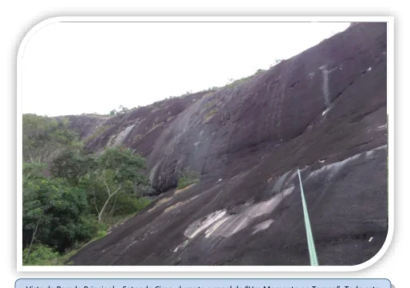

# Parede Principal – Setor Central

Capa: Tonico e Celso na conquista da "Hilda Furacão" (Foto: Glesse Gripp)

O setor apresenta, de um modo geral, vias nas quais predominam lances em agarras e impressionantes buracos, apesar de haver boa solicitação de aderência da sola na pedra. A extensão das vias neste setor (metade esquerda da Parede Principal) varia de 90 até 180 metros, com graduação de IIIsup até Vsup.

Neste setor, destacam-se as vias “Marcado a Ferro” (4º V – 180m), “Hilda Furacão” (3º IV – 165m), “Ferro no Judas” (5° Vsup – 130m), “Pé de Pano” (3° IV E1 – 150m) e “Cordão do Bola Preta” (D1 3° IVsup E2 – 130m – Mista), vias estas que, em seu conjunto, permitem um bom conhecimento desse trecho central da Parede Principal, além de satisfação garantida.

A título de curiosidade, neste setor localiza-se primeira via da região, a “Iron Men” (4º V – 160m), conquistada por Tonico, Juliano Magalhães e Marcos Leiras em fevereiro de 2006, dando início assim a mais um excelente polo de escaladas!

## Acesso

O acesso às bases das primeiras vias desse setor se dá pela trilha principal do Vale do Roncador, bifurcando à direita logo após a segunda travessia do córrego. Para as vias centrais da parede, deve-se seguir por mais alguns metros e pegar uma nova picada também à direita, iniciada em um pequeno barranco com uma árvore firme em cima. É possível margear a parede em quase toda sua extensão neste setor, facilitando assim a identificação da base das vias. Para as vias da extrema esquerda, deve-se pegar um rio seco de pedras, à frente de um bambuzal e ao córrego. A entrada é marcada com um pequeno totem de pedra.

## Registros Fotográficos

## Parede Principal – Setor de Cima

Como o nome sugere, este setor fica em uma área mais elevada da Parede Principal, contando com apenas duas vias até o momento. Este setor apresenta uma grande possibilidade de novas linhas, apesar do acesso ainda ser um pouco complexo.

Para chegar à base desta parede, pode-se subir pela trilha das vias da esquerda, na Parede Principal Central, pegando o rio seco de pedras, à frente de um bambuzal e ao córrego, com a entrada marcada com um pequeno totem de pedra (trilha oposta à utilizada para o acesso da Parede Das Aderências – Setor de Cima). Ao chegar na parede, deve-se costear a mesma para a esquerda, sempre subindo.

Outra forma de acesso é pegar a trilha da Parede Principal, Setor Clássicas Longas, com acesso às vias da direita. Subir pelo descampado e passar pela enorme laje de pedra. Ao chegar na base da via “Eu Não Sou de Ferro”, continuar margeando a parede para a direita, passar pela base das vias “Rio de Mão Dupla” e “À Francesa” e continuar pela picada que leva diretamente ao setor.

Atenção às pedras soltas, presentes em muitos pontos da parede neste setor!