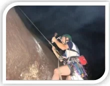

<small>Capa: Rodrigo Magalhães guiando a "Couro de Lobisomem" (Foto: Tamires Lima)</small>

Ao entrar no vale, o excursionista terá à sua direita o Setor das Clássicas Curtas, que se estende do início da Parede Principal até uma língua de mato que o separa do núcleo da parede. Este setor concentra vias curtas, variando de 10 a 45 metros.

As exceções são as vias “Vou Dançar um Xaxaxá” e “Águas de Março”, que apresentam 90 e 65 metros de extensão, respectivamente, localizadas na extremidade esquerda do setor, junto à referida língua de mato.

Para acessar a base destas vias, deve-se pegar a trilha principal do vale do Roncador e seguir por aproximadamente 50 metros, até a bifurcação à direita, que sobe alguns poucos metros, juntando com a parede. Esta trilha se estende por toda extensão do setor, sendo necessário apenas seguir pela mesma para atingir o início de todas as vias.

Com graduações variando entre III e VIsup, estas vias são perfeitas para treinamento em top-rope e guiada, neste caso pela ótima proteção que elas oferecem. Algumas vias possuem passadas em móvel, sempre em fendas sólidas, proporcionando proteções “à prova de bomba”.

## Esquema de Trilhas

- **1 – Base das vias "Deu Tilt" até "Entrando no Ferro"**
- **2 – Base das vias "Cambal a Quatro" até "Amor Profano"**
- **3 – Base das vias "Ferrolho" e "Ferroada"**
- **4 – Base das vias "Vou Dançar o Xaxaxá" e "Casas da Banha"**

