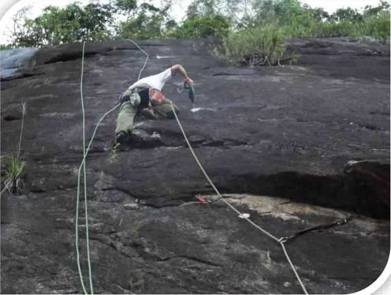

# Parede Principal – Direita

Localizada ao início da Parede Principal com vias de pequena extensão e muito boas para um primeiro contato com o tipo de escalada da região. Concentra vias que vão de 20 a 100 metros, em sua maioria bem protegidas por grampos de ½ polegada, com predominância de agarras, regletes e buracos, possuindo por vezes, algumas fendas interessantes.

O acesso às bases pode ser feito por duas picadas que derivam da trilha principal do Vale do Roncador, ambas aproximadamente 200 metros após a primeira travessia do córrego.

Na primeira opção, pega-se a bifurcação para a esquerda e com poucos metros de caminhada, cruza-se novamente o córrego. A descida é amena, porém após atravessar o córrego, existe um pequeno barranco. Tocando para cima, chega-se na base da via “Rapidinha no Escurinho”.

Na segunda picada, pega-se a bifurcação à esquerda, descendo por uma trilha um pouco íngreme antes de cruzar o córrego, para então, voltar a subir, chegando na base da via “O Burro e o Capacete”, onde se encontra o esqueleto de um burro que veio a falecer após cair do topo da parede (daí, parte do nome da via).

## Esquema de Trilhas e Acesso

- **1 – Base das vias “Cutícula” e “Pelinha”**
- **2 – Base das vias “Rapidinha no Escurinho” até a “Pele Vermelha”**
- **3 – Base das vias “Amor, Meu Grande Amor” e “Tá Bão”**
- **4 – Base da via “O Burro e o Capacete”**
- **5 – Base das vias “Valeu Papito” até a “Lobos do Caraça”**

