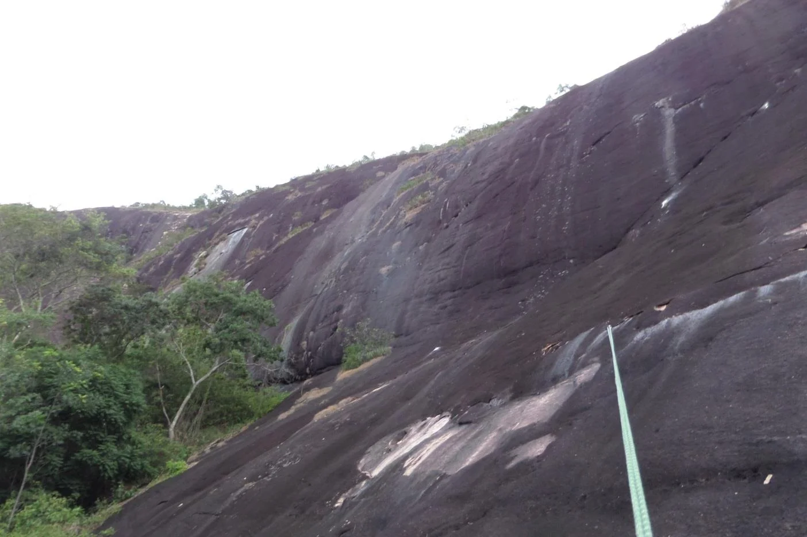

---
nome: Parede Principal – Setor de Cima
mapas:
- caminho_imagem_mapa: imagens/grupo_principal_setor_setor_de_cima_p1_i0.webp
- caminho_imagem_mapa: imagens/grupo_principal_setor_setor_de_cima_p2_i0.webp
escaladas:
- via_esportiva:
    nome: Um Momento no Tempo
    dificuldade: BR_6
    exposicao: E2
    extensao: 120
- via_esportiva:
    nome: Noite de São João
    dificuldade: BR_3SUP
    exposicao: E2
    extensao: 120
---

