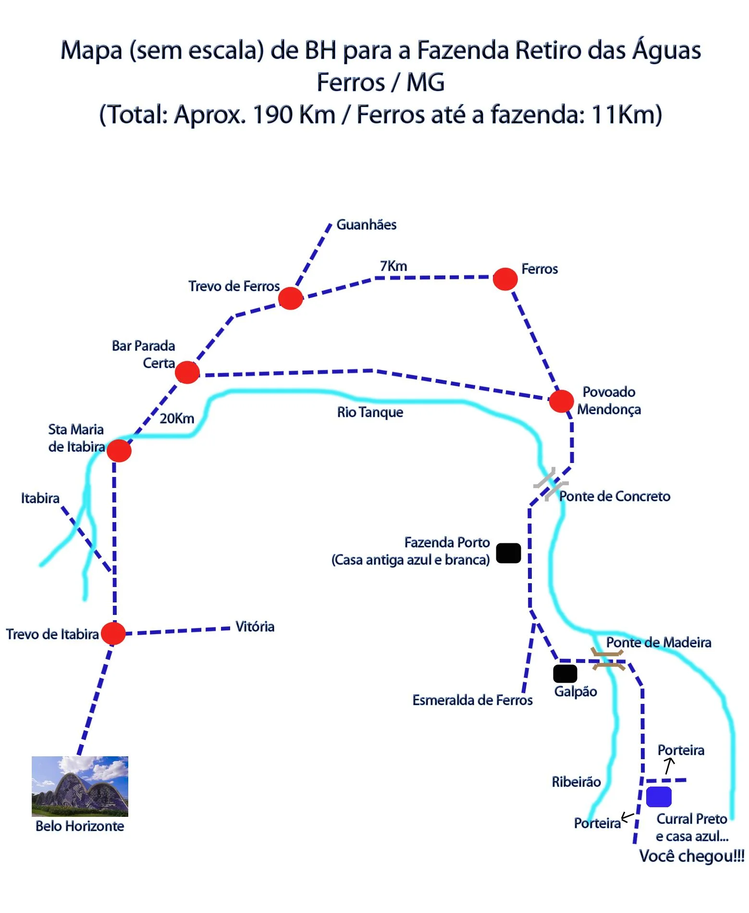
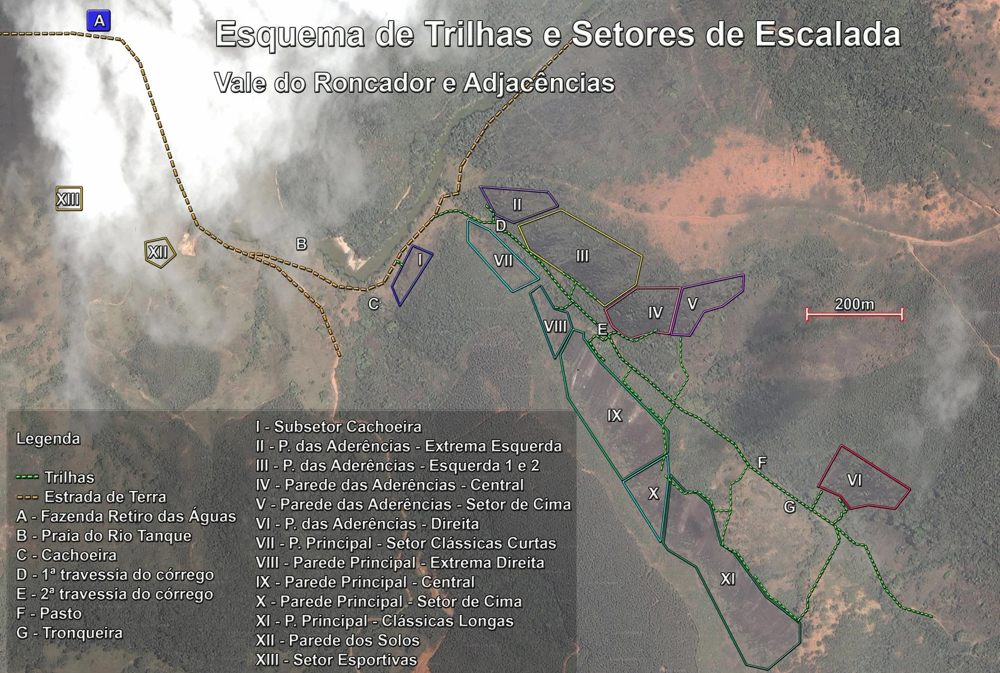

# Mapas Gerais

Mapas de localização das áreas de escalada em Ferros.

## Mapa de Acesso (esquemático)

## Mapa de Acesso (satélite)

## Esquema de Trilhas e Setores

**Legenda**
- Trilhas
- Estrada de Terra
- A - Fazenda Retiro das Águas
- B - Praia do Rio Tanque
- C - Cachoeira
- D - 1ª travessia do córrego
- E - 2ª travessia do córrego
- F - Pasto
- G - Tronqueira

**Setores**
- I - Subsetor Cachoeira
- II - P. das Aderências - Extrema Esquerda
- III - P. das Aderências - Esquerda 1 e 2
- IV - Parede das Aderências - Central
- V - Parede das Aderências - Setor de Cima
- VI - P. das Aderências - Direita
- VII - P. Principal - Setor Clássicas Curtas
- VIII - Parede Principal - Extrema Direita
- IX - Parede Principal - Central
- X - Parede Principal - Setor de Cima
- XI - P. Principal - Clássicas Longas
- XII - Parede dos Solos
- XIII - Setor Esportivas