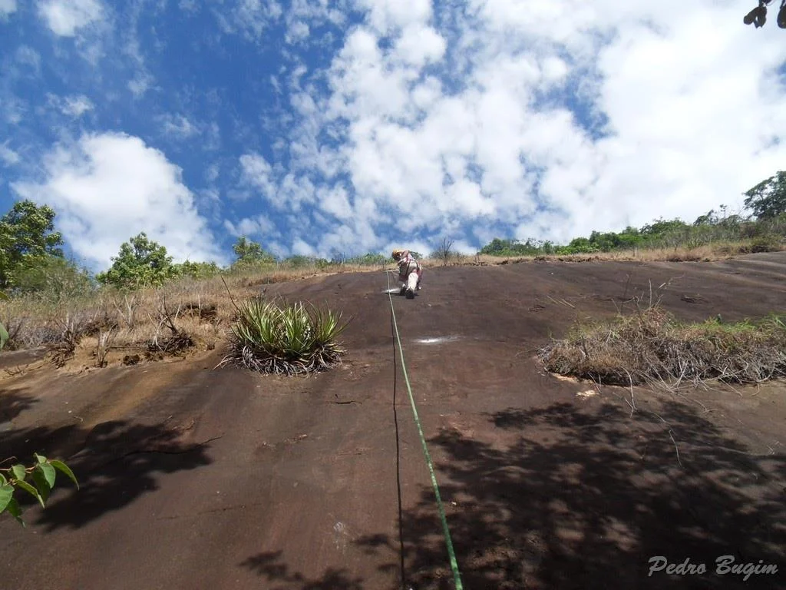

O Subsetor Cachoeira, próximo à Cachoeira do Córrego Sapé, conta com apenas quatro vias, ideais para os primeiros contatos com a escalada em rocha, em particular, para as vias tradicionais, com pouca inclinação e muita aderência.

A base destas vias fica a dez minutos da sede da fazenda Retiro das Águas, na lateral direita da estrada de terra, ainda acessível por automóveis, logo após uma pequena casa sem uso no lado esquerdo da mesma.

Este setor, apesar de curto e com lances simples, por ficar no sol o dia quase todo, apresenta uma parede bastante quente (como indica o nome de duas das vias), sendo ideal para escaladas pela parte inicial da manhã, ou ao final da tarde.