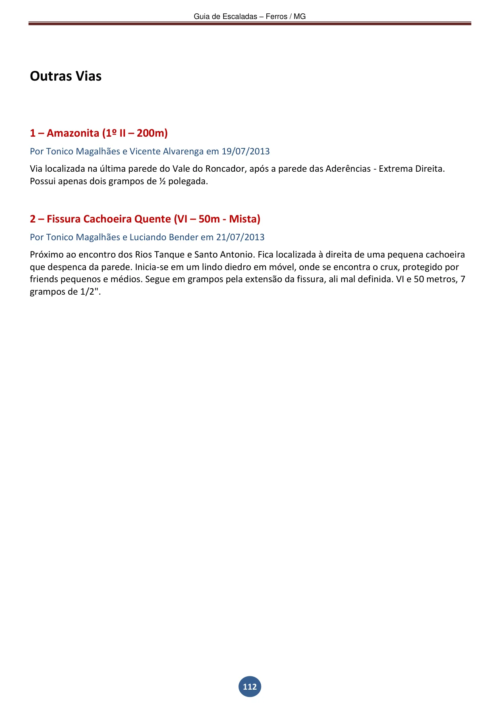

---
nome: Outras Vias
escaladas:
- via_esportiva:
    nome: Amazonita
    dificuldade: BR_2
    extensao: 200
    conquistadores:
    - Tonico Magalhães
    - Vicente Alvarenga
    data_abertura: '2013-07-19'
    descricao: Via localizada na última parede do Vale do Roncador, após a parede das 
      Aderências - Extrema Direita. Possui apenas dois grampos de ½ polegada.
- via_movel:
    nome: Fissura Cachoeira Quente
    dificuldade: BR_6
    extensao: 50
    conquistadores:
    - Tonico Magalhães
    - Luciando Bender
    data_abertura: '2013-07-21'
    descricao: |
      Próximo ao encontro dos Rios Tanque e Santo Antonio. Fica localizada à direita de uma pequena cachoeira que despenca da parede. Inicia-se em um lindo diedro em móvel, onde se encontra o crux, protegido por friends pequenos e médios. Segue em grampos pela extensão da fissura, ali mal definida. VI e 50 metros, 7 grampos de 1/2". ESTILO: MISTA
---

