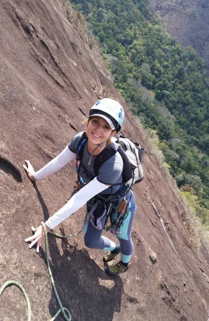

---
nome: Parede da Água Limpa
mapas:
- caminho_imagem_mapa: imagens/setor_parede_da_agua_limpa_p1_i0.webp
  referencias:
  - escalada: Pr. Dama de Ferros
    ids:
    - '1'
- caminho_imagem_mapa: imagens/setor_parede_da_agua_limpa_p2_i1.webp
escaladas:
- via_multiplas_enfiadas:
    nome: Pr. Dama de Ferros
    dificuldade_media: BR_4
    dificuldade_maxima: BR_4SUP
    exposicao: E2
    duracao: D2
    comprimento_total: 405
    conquistadores:
    - Pedro Bugim
    - Vivianne Sawczuk
    - Tiago “Fox” Bastos
    - Elton Soares
    - Rodrigo Tinoco
    - Alexandre Mesquita
    - Luciano Bender
    - Gustavo “Xaxá” Carrozzino
    - Celso Ferreira Gomes
    - Tonico Magalhães
    data_abertura: '2015-09-06'
    descricao: Atualmente, a única via da parede, e maior via da região de Ferros, contando com 405 metros de parede. Foi conquistada em três investidas com participantes distintos, demorando cerca de quatro anos para ser finalizada. Corta toda a parede frontal principal, seguindo uma linha bem natural e sem lances muito complicados. Predomina a aderência, e, em alguns lances, agarras abauladas. Proteção predominante em grampos de ½, possuindo algumas chapeletas na enfiada final. Nesta última enfiada, é possível rapelar de chapas com argola, colocadas a cada 25 metros. Rapel possível com corda de 60m, sendo recomendado a utilização de duas cordas de 60.
---

As paredes de Água Limpa ficam situadas no vale homônimo e distantes cerca de seis quilômetros do vale do Roncador (onde fica a maioria das escaladas do guia). Para se chegar lá, deve-se ir para o encontro dos rios Santo Antonio e Tanque, conhecido ponto turístico de Ferros, seguindo-se a estrada que acompanha o rio Tanque por cerca de cinco quilômetros abaixo da fazenda-sede. De lá uma rápida estrada adentra ao mágico vale.

O vale Água Limpa chamou atenção por possuir paredes gigantescas com comprimentos que podem atingir mais de 600 metros. A via Dama de Ferros é a primeira do local e possui mais de 400 metros. Um projeto, que visa aproveitar a máxima extensão da parede, já foi iniciado em meio a uma grande extensão de paredes intocadas.
