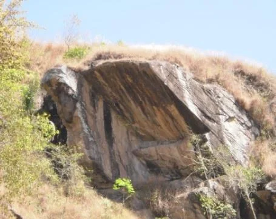

Apresenta vias curtas, em torno de 10 a 15 metros, de V até VIIIa, de muito fácil acesso, pois o setor está muito próximo da sede da fazenda, a cerca de 15 minutos de caminhada. Permite escalar algumas vias mesmo após dias de chuva moderada, pois um grande teto as protege.

Os conquistadores neste setor, até o momento, são: Tonico, Nádia Moreira, Emerson Caverna, Fabiano Fernandes, Juliano Magalhães e Valdinei Lima, com destaque para os dois últimos, em função da quantidade: dez e nove vias, respectivamente.

Dentre suas 14 vias, destacam-se “Jabá com Jerimum” (VI), “Rabada” (VIIa), “Vomitão em Ferros” (VIIIa) e “Bruxa Albano” (VI).