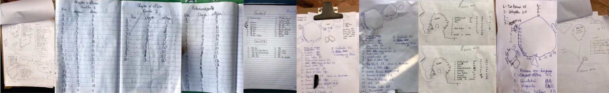

---
---

# IGARAMECA

Não se sabe ao certo quando começou a escada na região, estudos em andamento apontam entre as décadas de 80/90. Há três anos, um grupo de escaladores de Belo Horizonte se reuniu com a ideia de transformar o Complexo da Pedra Grande em um dos principais picos de escalada da região. Foi assim que nasceu o @igarameca, numa prosa após um dia de muito climbing no pé da pedra.

Esse sonho tem se tornado realidade dia após dia, com muito trabalho, dedicação e claro, muita escalada boa. Atualmente o complexo possui mais de 150 vias esportivas e 500 boulders, além de rotas tradicionais e móveis, todas esculpidas na rocha única de Itabirito.

Os croquis são os "mapas" que guiam os praticantes da escalada no local, sendo um facilitador para a pratica do esporte e acreditamos resultar em um ganho a todos. E para que cada vez mais escaladores possam usufruir e desbravar o potencial do local, inicialmente estamos lançando este **CROQUI DOS SETORES E VIAS DE ESCALADAS ESPORTIVA** catalogadas no complexo da Pedra Grande em Igarapé/MG, atualizações serão adicionadas no decorrer do projeto... "e as vias trad, móvel e os boulders!?". C A L M A turma, anos e anos de desenvolvimento, muita informação a receber e em breve teremos um livro gigante repleto de informações e detalhes!!! Vamoooo!!!

[@igarameca](https://www.instagram.com/igarameca)