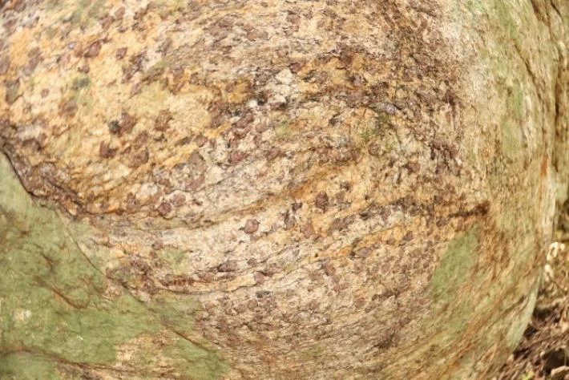

# Mas que rocha é essa?

As rochas do Vale Verde são chamadas **Granada - Biotita Tonalito**, são correspondentes a um magmatismo sintéctonico de idade Neoproterozoíca (1000 a 570 milhões de anos) denominadas de Tonalito Bom Jesus do Galho (CPRM, Folha Dom Cavati – 2014).

De forma simplificada essas rochas seriam um tipo de Granitoíde (um tipo de rocha ígnea que se cristaliza no interior da crosta), rico em minerais como a Granada, Biotita, Plagioclásio, Cianita e outros minerais ricos em sílica. Essas rochas após cristalizadas passaram posteriormente por processos de metamorfismo (aumento de pressão e temperatura que promovem alterações na sua composição mineral e estrutura) sendo esse fato evidenciado pelas foliações identificadas nas rochas do Vale Verde.

Os registros nessas rochas contam um pouco da história da formação de um supercontinente chamado Gondwana, que ocorreu aproximadamente à 750 e 600 Milhões de anos atrás, durante a colisão do que hoje seriam os continentes da América do Sul, Antártida, África, Índia e Oceania. Durante esse episódio de colisões de placas tectônicas foi gerado uma enorme cordilheira de montanhas, correspondente ao que seria hoje o Himalaia.

Os Granitos/Tonalito são formados no interior dessa cordilheira, a partir de processos de fusão de rochas, migração e resfriamento de magmas no interior da crosta terrestre. Quando placas tectônicas colidem, as mais densas e espessas são subductadas até porções profundas da crosta, que se fundem como resultado da alta pressão e temperatura, gerando um extenso volume de magmas. Esses magmas caso consigam ascender e romper toda a crosta terrestre acabam sendo expelidos na forma de erupções vulcânicas, se não conseguirem acabam se cristalizando no interior da crosta, formando diversos tipos de rochas ígneas intrusivas como por exemplo os Granitos e os Tonalitos.

Depois que esse magma se cristalizou no interior da crosta foi só aguardar cerca de 600 milhões de ano até a natureza fazer o seu papel, erodindo aproximadamente entre 6 e 7km de quilômetros de rocha e expondo a base dessa cordilheira, repleta de lindos monólitos de granitos e tonalitos sedentos por um escalador.

# É boa para escalar?

O Tonalito do Vale Verde apresenta uma boa condição para a escalada, são conhecidos por ser uma rocha abrasiva sobretudo por causa de sua granulação grossa e composição rica em granadas, quazto e feldspato. Devido sua exposição em falésia é comum encontrarmos agarras quebradiças, por isso a equipe de conquista sempre se atenta em colar as agarras que estão frágeis, aumentando a segurança na escalada e preservando as agarras cruciais para a realização da via. Se identificar alguma agarra com esse risco favor comunicar imediatamente a AMEVA para a tomada das devidas providências.

As vias são majoritariamente verticais ou levemente negativas, com bastante regletes potentes, abaulados e oposições clássicas. Devido a abrasão da rocha os pés funcionam até mesmo nos pequenos cristais, tornando a escalada no Vale Verde bastante técnica e exigente em relação ao equilíbrio e força de regletes.