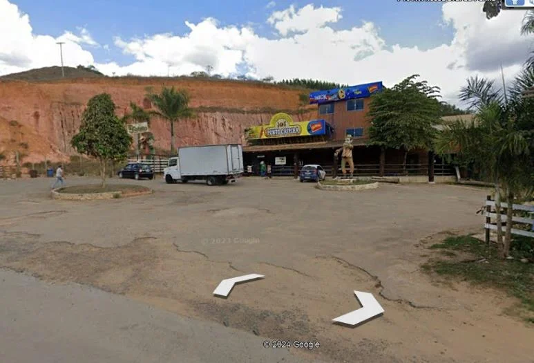
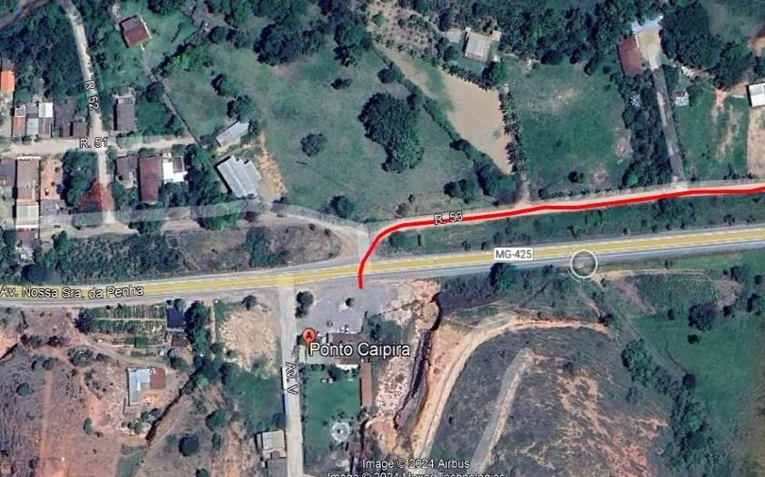
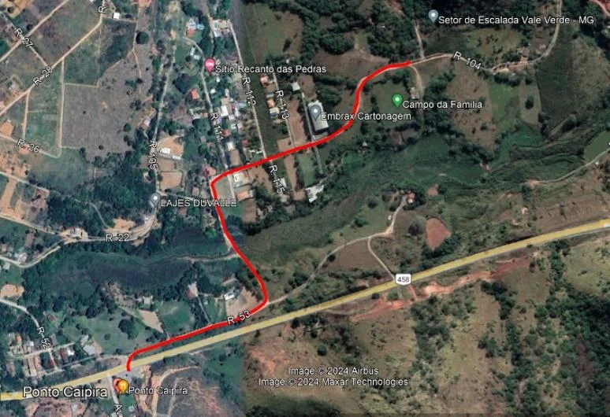
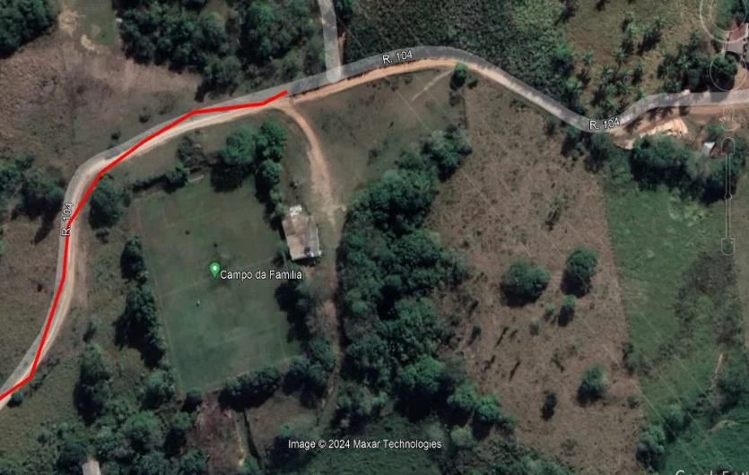

# Localização

No Google Maps procure por **"Setor de Escalada Vale Verde"**.

Saindo de Ipatinga siga por 21,1 KM no sentido IPABA pela BR-458 até o **Ponto Caipira** (Direta da estrada), do outro lado da pista há uma bifurcação de estrada de chão, atravesse a pista e siga a direita. Continue na estrada principal até uma bifurcação, mantenha-se a esquerda pela estrada principal, cruze a pequena ponte de ferro (COPASA) sobre o córrego. Continue pela estrada principal até o campo de futebol. Estacione nos arredores do Campo de Futebol e siga por trilha até o setor.

