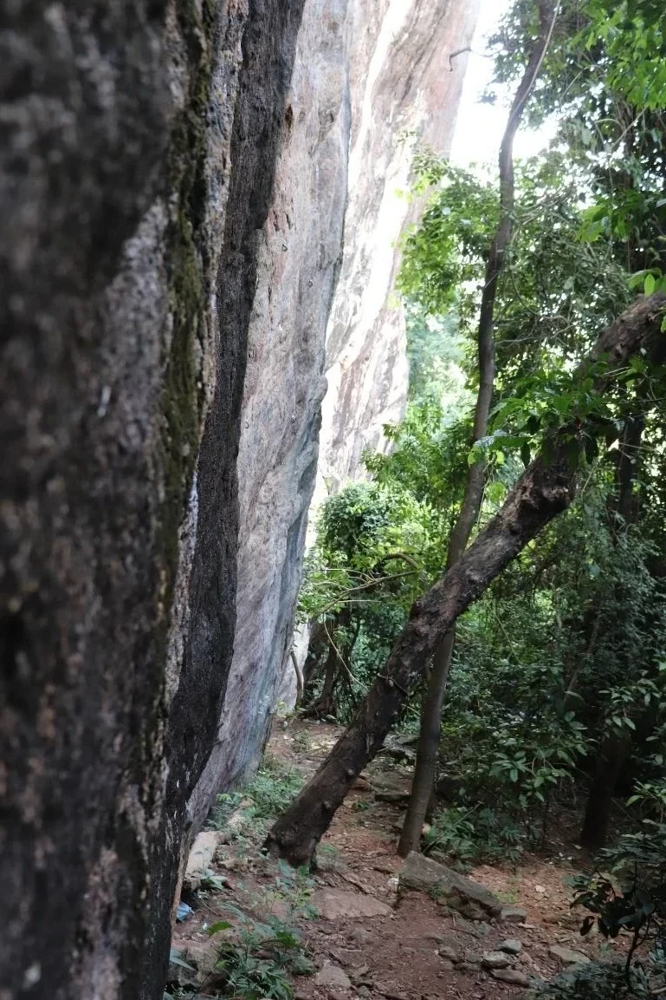

---
nome: 1° Andar
mapas:
- caminho_imagem_mapa: imagens/setor_1_andar_p0.webp
  largura_mapa: 442
  altura_mapa: 1653
  pontos_de_interesse:
  - id: '01'
    label: '1'
    box:
      x: 394
      y: 1620
      comprimento: 21
      largura: 29
  - id: '02'
    label: '2'
    box:
      x: 373
      y: 1571
      comprimento: 24
      largura: 32
  - id: '03'
    label: '3'
    box:
      x: 358
      y: 1528
      comprimento: 21
      largura: 30
  - id: '04'
    label: '4'
    box:
      x: 352
      y: 1482
      comprimento: 13
      largura: 17
  - id: '05'
    label: '5'
    box:
      x: 341
      y: 1434
      comprimento: 24
      largura: 30
  - id: '06'
    label: '6'
    box:
      x: 332
      y: 1369
      comprimento: 19
      largura: 26
  - id: '07'
    label: '7'
    box:
      x: 318
      y: 1305
      comprimento: 18
      largura: 20
  - id: '08'
    label: '8'
    box:
      x: 316
      y: 1264
      comprimento: 17
      largura: 22
  - id: '09'
    label: '9'
    box:
      x: 320
      y: 1213
      comprimento: 17
      largura: 22
  - id: '10'
    label: '10'
    box:
      x: 318
      y: 1118
      comprimento: 25
      largura: 22
  - id: '11'
    label: '11'
    box:
      x: 312
      y: 1070
      comprimento: 25
      largura: 20
  - id: '12'
    label: '12'
    box:
      x: 318
      y: 808
      comprimento: 26
      largura: 23
  - id: '13'
    label: '13'
    box:
      x: 316
      y: 768
      comprimento: 28
      largura: 29
  - id: '14'
    label: '14'
    box:
      x: 308
      y: 700
      comprimento: 25
      largura: 25
  - id: '15'
    label: '15'
    box:
      x: 306
      y: 592
      comprimento: 33
      largura: 31
  - id: '16'
    label: '16'
    box:
      x: 312
      y: 541
      comprimento: 32
      largura: 32
  - id: '17'
    label: '17'
    box:
      x: 317
      y: 472
      comprimento: 26
      largura: 27
  - id: '18'
    label: '18'
    box:
      x: 316
      y: 436
      comprimento: 25
      largura: 24
  - id: '19'
    label: '19'
    box:
      x: 317
      y: 394
      comprimento: 28
      largura: 23
  - id: '20'
    label: '20'
    box:
      x: 324
      y: 310
      comprimento: 25
      largura: 23
  - id: '21'
    label: '21'
    box:
      x: 336
      y: 262
      comprimento: 30
      largura: 30
  - id: '22'
    label: '22'
    box:
      x: 337
      y: 204
      comprimento: 24
      largura: 23
  - id: '23'
    label: '23'
    box:
      x: 342
      y: 158
      comprimento: 24
      largura: 23
  - id: '24'
    label: '24'
    box:
      x: 345
      y: 97
      comprimento: 30
      largura: 30
  - id: Trilha_Jurassico
    label: Trilha para o Setor Jurássico (Muito Fechada)
    box:
      x: 196
      y: 78
      comprimento: 115
      largura: 157
  - id: Trilha_Boulders_2nd
    label: Trilha Boulders e 2º Andar
    box:
      x: 109
      y: 565
      comprimento: 134
      largura: 82
  - id: Voce_esta_aqui
    label: Você está aqui
    box:
      x: 218
      y: 1314
      comprimento: 38
      largura: 43
  referencias:
  - escalada: Jardineiro
    ids:
    - '01'
  - escalada: Somelier Canábico
    ids:
    - '02'
  - escalada: Jovens Dinâmicos
    ids:
    - '03'
  - escalada: Anunnaki
    ids:
    - '04'
  - escalada: Peyote Sativo
    ids:
    - '05'
  - escalada: Fake News
    ids:
    - '06'
  - escalada: Bruxa
    ids:
    - '07'
  - escalada: Fundão
    ids:
    - '08'
  - escalada: Caminho da Luz
    ids:
    - '09'
  - escalada: Eu quero é ver o oco
    ids:
    - '10'
  - escalada: Mister Amaral
    ids:
    - '11'
  - escalada: Loki
    ids:
    - '12'
  - escalada: Thor
    ids:
    - '13'
  - escalada: A Flor da Vida
    ids:
    - '14'
  - escalada: Vale do Verde
    ids:
    - '15'
  - escalada: Ragnarok
    ids:
    - '16'
  - escalada: Filho de Odin
    ids:
    - '17'
  - escalada: Vahala
    ids:
    - '18'
  - escalada: Pedra no Saco
    ids:
    - '19'
  - escalada: Endorfina
    ids:
    - '20'
  - escalada: Isaurinha
    ids:
    - '21'
  - escalada: Presentim
    ids:
    - '22'
  - escalada: Antes tarde do que nunca
    ids:
    - '23'
  - escalada: Ho Ho Ho
    ids:
    - '24'
escaladas:
- via_esportiva:
    nome: Jardineiro
    dificuldade: BR_8A
    quantidade_protecoes_intermediarias: 8
    quantidade_protecoes_parada: 2
    extensao: 15
    destaque: true
- via_esportiva:
    nome: Somelier Canábico
    dificuldade: BR_7A
    quantidade_protecoes_intermediarias: 8
    quantidade_protecoes_parada: 2
    extensao: 15
    destaque: true
- via_esportiva:
    nome: Jovens Dinâmicos
    dificuldade: BR_7A
    quantidade_protecoes_intermediarias: 8
    quantidade_protecoes_parada: 2
    extensao: 15
    destaque: true
- via_esportiva:
    nome: Anunnaki
    dificuldade: BR_7C
    quantidade_protecoes_intermediarias: 8
    quantidade_protecoes_parada: 2
    extensao: 15
    destaque: true
- via_esportiva:
    nome: Peyote Sativo
    dificuldade: BR_7A
    quantidade_protecoes_intermediarias: 8
    quantidade_protecoes_parada: 2
    extensao: 13
    destaque: true
- via_esportiva:
    nome: Fake News
    dificuldade: BR_7B
    quantidade_protecoes_intermediarias: 7
    quantidade_protecoes_parada: 2
    extensao: 12
    destaque: true
- via_esportiva:
    nome: Bruxa
    dificuldade: BR_5
    quantidade_protecoes_intermediarias: 4
    quantidade_protecoes_parada: 2
    extensao: 8
- via_esportiva:
    nome: Fundão
    dificuldade: BR_6
    quantidade_protecoes_intermediarias: 4
    quantidade_protecoes_parada: 2
    extensao: 8
    descricao: Extensão Projeto (6+2).
- via_esportiva:
    nome: Caminho da Luz
    dificuldade: BR_7B
    quantidade_protecoes_intermediarias: 8
    quantidade_protecoes_parada: 2
    extensao: 20
    destaque: true
- via_esportiva:
    nome: Eu quero é ver o oco
    dificuldade: BR_8B
    quantidade_protecoes_intermediarias: 8
    quantidade_protecoes_parada: 2
    extensao: 20
    destaque: true
- via_esportiva:
    nome: Mister Amaral
    dificuldade: BR_8B
    quantidade_protecoes_intermediarias: 11
    quantidade_protecoes_parada: 2
    extensao: 20
    destaque: true
- via_esportiva:
    nome: Loki
    dificuldade: PROJETO
    quantidade_protecoes_intermediarias: 11
    quantidade_protecoes_parada: 2
- via_esportiva:
    nome: Thor
    dificuldade: BR_8B
    quantidade_protecoes_intermediarias: 8
    quantidade_protecoes_parada: 2
    destaque: true
- via_esportiva:
    nome: A Flor da Vida
    dificuldade: BR_7A
    quantidade_protecoes_intermediarias: 5
    quantidade_protecoes_parada: 2
    extensao: 12
    destaque: true
    descricao: Possui Extensão Projeto (7+2).
- via_esportiva:
    nome: Vale do Verde
    dificuldade: BR_7C
    quantidade_protecoes_intermediarias: 4
    quantidade_protecoes_parada: 2
    extensao: 10
    destaque: true
    descricao: Possui Extensão 8c (10+2).
- via_esportiva:
    nome: Ragnarok
    dificuldade: BR_9A
    quantidade_protecoes_intermediarias: 11
    quantidade_protecoes_parada: 2
    extensao: 25
    destaque: true
- via_esportiva:
    nome: Filho de Odin
    dificuldade: BR_8B
    quantidade_protecoes_intermediarias: 5
    quantidade_protecoes_parada: 2
    extensao: 15
    destaque: true
    descricao: Possui Extensão Proj. (5+2).
- via_esportiva:
    nome: Vahala
    dificuldade: PROJETO
    quantidade_protecoes_intermediarias: 12
    quantidade_protecoes_parada: 2
    extensao: 20
- via_esportiva:
    nome: Pedra no Saco
    dificuldade: BR_7A
    quantidade_protecoes_intermediarias: 10
    quantidade_protecoes_parada: 2
    extensao: 20
- via_esportiva:
    nome: Endorfina
    dificuldade: BR_7A
    quantidade_protecoes_intermediarias: 11
    quantidade_protecoes_parada: 2
    extensao: 22
    destaque: true
- via_esportiva:
    nome: Isaurinha
    dificuldade: BR_7A
    quantidade_protecoes_intermediarias: 10
    quantidade_protecoes_parada: 2
    extensao: 18
    destaque: true
- via_esportiva:
    nome: Presentim
    dificuldade: BR_7A
    quantidade_protecoes_intermediarias: 8
    quantidade_protecoes_parada: 2
    extensao: 18
- via_esportiva:
    nome: Antes tarde do que nunca
    dificuldade: BR_6
    quantidade_protecoes_intermediarias: 9
    quantidade_protecoes_parada: 2
    extensao: 15
- via_esportiva:
    nome: Ho Ho Ho
    dificuldade: BR_5
    quantidade_protecoes_intermediarias: 9
    quantidade_protecoes_parada: 2
    extensao: 15
---
# 1° Andar

O 1° Andar é o principal setor da Falésia do Vale Verde, com uma grande concentração de vias de alta dificuldade técnica.

