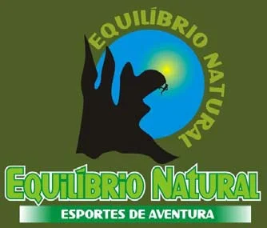

# CROQUI DO SALÃO ENCANTADO – JANUÁRIA MG

## Importante!!
A região do Salão Encantado é foco do **mosquito palha**.
**É extremamente necessário o uso de repelentes para evitar a ação do mosquito.**
Aconselhável o uso de roupas compridas (blusa longa e calça).

O local possui temperaturas um pouco elevadas em horários próximos ao meio dia. Aconselha-se levar muita água para não desidratar.

## Como chegar
**De carro.** Em Montes Claros siga para o Distrito Industrial (Av. João 23) até a fábrica de cimento. Passe em frente a fábrica e continue na estrada (BR 135) seguindo para Januária. A primeira cidade é Mirabela, continue seguindo a BR 135 passando por Japonvar seguindo até a cidade de Lontra e logo depois a cidade de Januária. A distância de Lontra até a ponte sobre o rio são Francisco são exatamente 40 km. Depois de passar sobre a ponte, aproximadamente 10 km depois chegará no posto da policia rodoviária, logo depois será o trevo de januária, vire a esquerda no trevo. Chegará a um segundo trevo (chapada gaúcha) continue seguindo reto até um terceiro trevo que fica próximo ao aeroporto. Vire a esquerda no terceiro trevo no sentido para Barreiro em uma estrada de terra. Siga na estrada aproximadamente 5 km depois do trevo e vire a esquerda em um aglomerado rochoso.

**De Ônibus.** Chegando na rodoviária de Januária (aproximadamente 10 km do salão encantado), seguir em direção à comunidade de Barreiro próximo ao aeroporto. De Montes Claros, procurar na rodoviária pela empresa Transnorte. Até o dia 01 de outubro de 2012 o horário de saída do ônibus é as 05:00 horas (cinco horas da manhã).

**De Avião.** Desembarcar no aeroporto de Montes Claros e seguir de carro ou de ônibus para Januária.