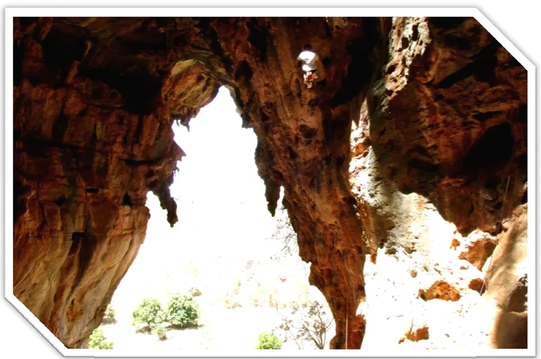

---
nome: Setor da Claraboia
mapas:
- caminho_imagem_mapa: imagens/setor_da_claraboia_p0.webp
  largura_mapa: 704
  altura_mapa: 580
  pontos_de_interesse:
  - id: '01'
    label: '01'
    box:
      x: 228
      y: 374
      comprimento: 29
      largura: 36
  - id: '02'
    label: '02'
    box:
      x: 174
      y: 324
      comprimento: 29
      largura: 37
  - id: Pracinha
    label: Pracinha
    box:
      x: 362
      y: 476
      comprimento: 134
      largura: 35
  referencias:
  - escalada: Calazar Certo
    ids:
    - '01'
  - escalada: Cabeça de Rato
    ids:
    - '02'
escaladas:
- via_esportiva:
    nome: Calazar Certo
    dificuldade: BR_7B
    descricao: Via mais clássica do salão encantado. Via longa em chorreiras e agarrões. 
      Recomendada para todos.
- via_esportiva:
    nome: Cabeça de Rato
    dificuldade: BR_7A
    descricao: Primeiro grampo a 5 metros do chão. Escalada de um 3º grau positivo para 
      chegar ao grampo.
---
ATENÇÃO! Para chegar no o setor é preciso fazer uma escalaminhada cuidadosa. Cuidado com pedras soltas e trilhas altas. Opção para descida é fazer um rapel a partir do top da via Cordadinha.

