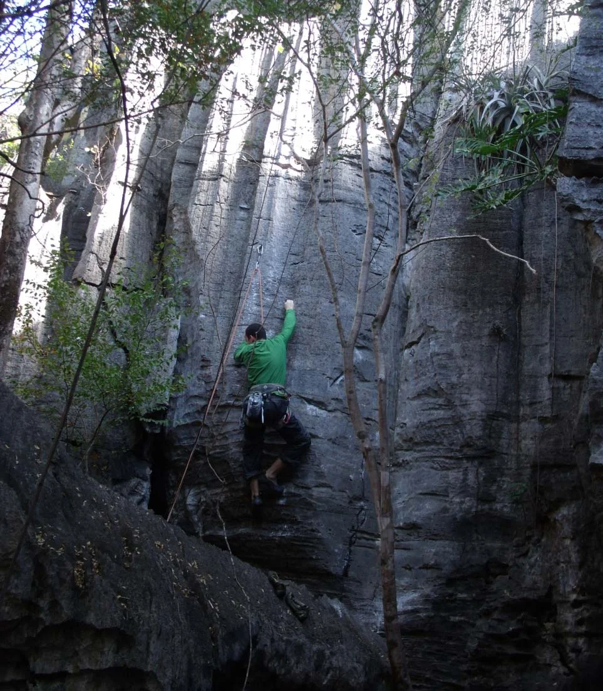

O setor fica localizado acima da claraboia. Para chegar até o Abrigo é preciso fazer uma caminhada passando em frente ao setor do sertão. É necessário escalar um pequeno bloco de rocha para chegar ao setor.

