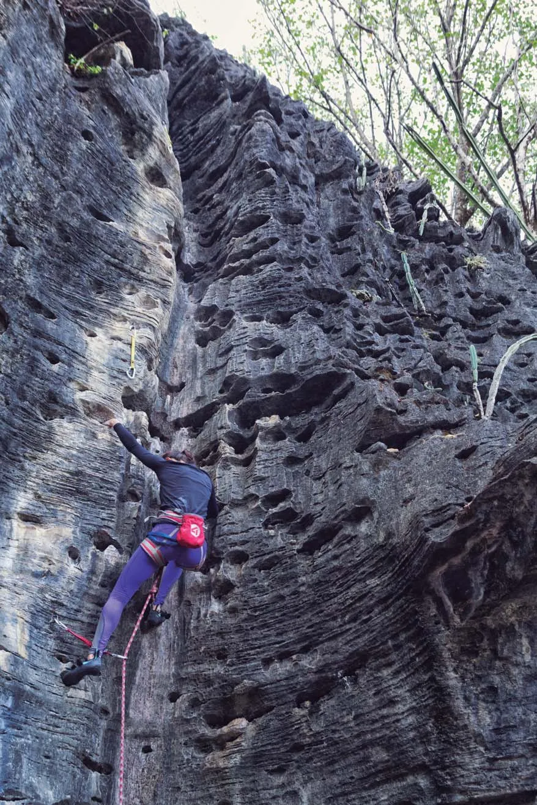

# Comércio local:

* **Bar da Neri:**
Serve bebidas, tira gostos e almoço. Este é o bar tem mais de 20 anos e fica a 200 metros da entrada do Sítio é o mais clássico para os escaladores, onde a Senhora Neri faz questão de receber muito bem! funciona de terça a domingo das 11:00 as 22:00

* **Casa da Jacque:**
Oferece almoço, produtos artesanais, aluguel de cavalos, UBER. Funciona de segunda a sexta para almoço e jantar, aos fins de semana com reservas.
Endereço: Rua São Vicente de Paula 181

* **Mercado Caminho da Roça:** Alimentos e produtos de higiene - R. Guillermina Pereira de Freitas 830.
Ter a Dom. de 7:00 as 18:00

* **Restaurante Gruta da Lapinha:** Pratos a la carte - R. do Rosario 831 Ter. a Dom. 11:00 as 16:00.

* **Tocaias Bar: PF e bebidas** - R. do Engenho 35
Quin a Ter. de 10:00 as 20:00

* **Tele Marmitex da Adriana:** Tel. 31. 99525.8869
Sábados e Domingos

* **Distribuidora Hudson:** Churrasquinhos, porções e bebidas - R Gulhermina Pereira de Freitas 866
Ter. a Dom. de 10:00 as 22:00 Tel 31.3689.8078

* **Vila Real:** Padaria, Farmacia, Açougue e Horti Fruti
Av São Sebastião 1650 Seg. a Sab. de 7:00 as 19:30

