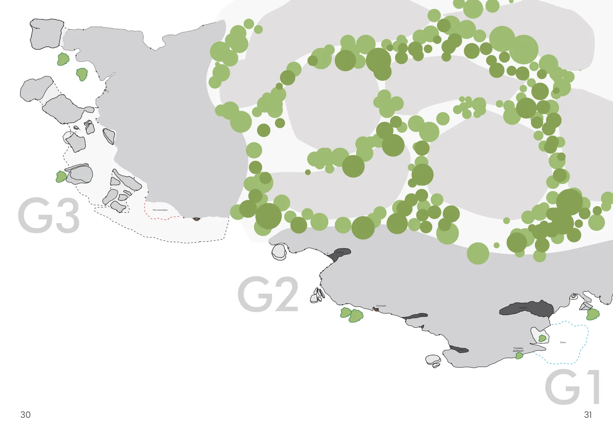

# Mapa dos setores

O Sítio do Rod possui três setores principais: G1, G2 e G3.
A caminhada do estacionamento até a base da rocha leva cerca de cinco minutos.
Existem também vários boulders e travessias espalhados pelos setores.

