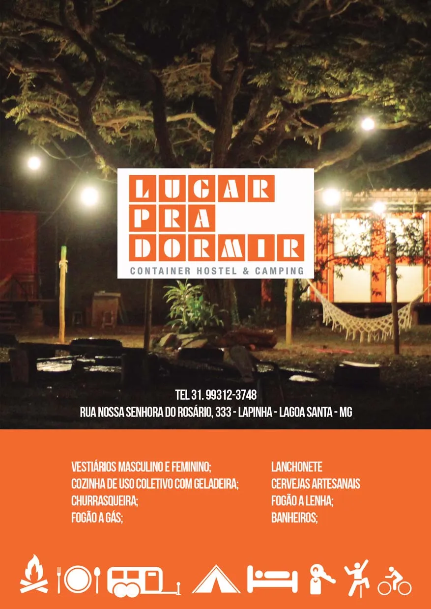

# O Sítio do Rod:

O Sítio está Localizado na região que é considerada um dos berços da escalada esportiva em Minas Gerais. Desde a abertura de suas primeiras vias, na segunda metade da década de 90, se destaca como um importante Campo Escola de escalada na região.
Desde então o Sítio do Rod foi e continua sendo palco de inúmeras histórias de escaladores que por aqui passam e desfrutaram desse pequeno reduto da escalada esportiva mineira.

Fica localizado a apenas 50 km do centro de Belo Horizonte e 16 km do Aeroporto Internacional de Confins.
Possui hoje cerca de 70 vias de escalada entre esportivas e móveis com graduações que vão do 4° ao 10° grau, com qualidade e variedade de estilos e algumas vias se mantém secas mesmo nos dias mais chuvosos.
É muito fácil o acesso aos setores de escalada, são cerca de cinco minutos de caminhada do estacionamento até a base da Rocha, com isso também se torna perfeito para as Crianças terem seus primeiros contatos com a escalada e vivências em ambiente de natureza.

A proximidade com outras áreas de escalada como a Lapa do Seu Antão, as Grutas da Lapinha e do Baú e Serra do Cipó, formando assim o maior circuito de escalada em Calcário do Brasil, atraindo escaladores de todas as partes do país e do mundo inteiro.

Container Hostel & Camping
TEL 31. 99312-3748
Rua Nossa Senhora do Rosário, 333 - Lapinha - Lagoa Santa - MG

* Vestiários masculino e feminino
* Cozinha de uso coletivo com geladeira
* Churrasqueira
* Fogão a gás
* Lanchonete
* Cervejas artesanais
* Fogão a lenha
* Banheiros