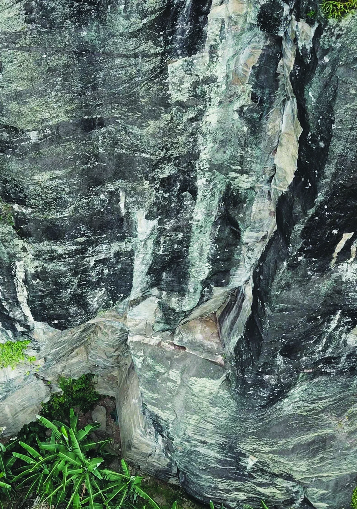

# Agradecimentos

Um agradecimento póstumo ao Sr. José Luis, antigo proprietário que liberou inicialmente o acesso ao setor de escalada. Agradeço à viúva e atual proprietária, Dona Rose, por continuar permitindo o acesso. Um agradecimento aos amigos escaladores que contribuíram para que de alguma maneira o setor virasse realidade. A todos o meu obrigado! Bito Meyer, Diego Serrano (Kri), Rodrigo (Braga), Fernando Aranha, Karina Filgueiras, Paula Manso, Renato (Mineiro), Edu Felício, Marcio Rosa, Claudia Faria, Antero Macedo, Débora Abe, Luiz Coslope (pelo acesso às imagens do drone), Azeite e Dionísio, e a todos que não foram citados nessa lista!

Como diria John Muir: "As montanhas estão chamando e eu preciso ir".

Boas escaladas!

**Bruno Matta (Kbeça)**

> [!IMPORTANT]
> **ATENÇÃO!**
> ESTA É UMA ÁREA PARTICULAR
> RESPEITE AS REGRAS!