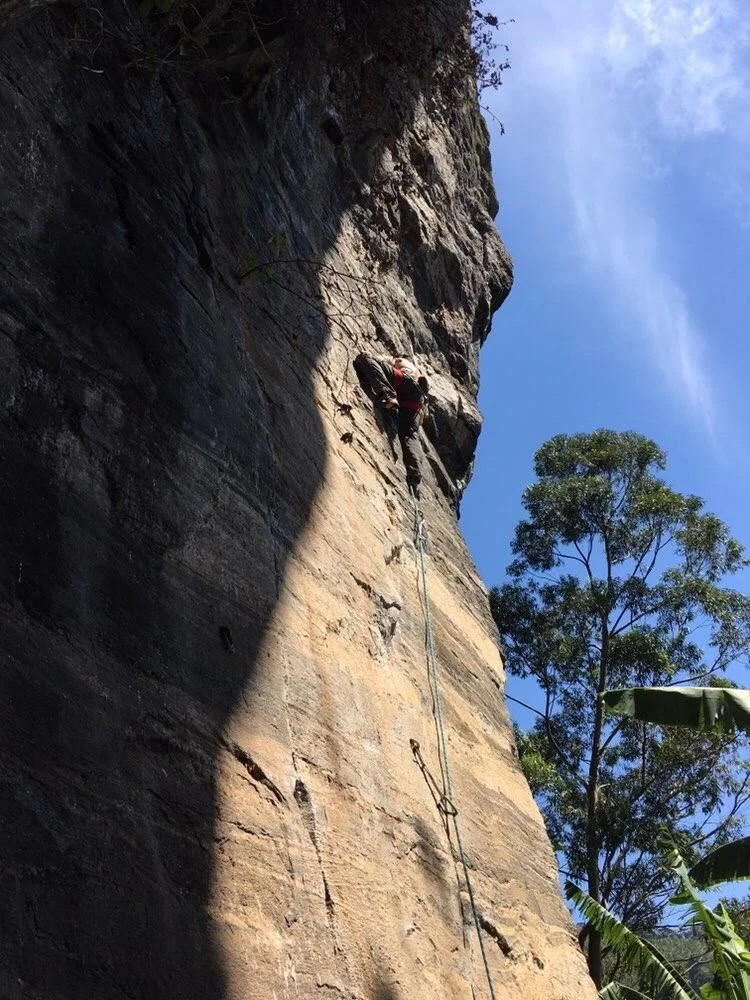

# Orientações aos Escaladores

## Segurança
A escalada é um esporte que expõe ao risco de acidentes, e a ajuda externa pode não estar disponível. Com isto em mente, a escolha de realizar esta atividade é sua responsabilidade. Você é responsável por sua própria segurança. As ações individuais não devem colocar em risco as pessoas ao seu redor, nem o meio ambiente, por isso atente-se a essas questões.

## Marimbondos, Vespas e Abelhas
Por ser um setor novo de escalada, recomenda-se levar inseticida (p.e: alcance) para retirada de marimbondos e vespas; No caso de abelhas não utilize o veneno e baixe do ponto de onde estiver o mais rápido possível. Existe um enxame mapeado no cume do totem, na face oposta da via nº 20 "Se meu fusca escalasse".

## Meio Ambiente
A liberdade de acesso às montanhas e falésias deve ser usufruída de maneira responsável e é um direito fundamental. Devemos sempre praticar nossas atividades de maneira ambientalmente sensível e ser pró-ativos na preservação da natureza. Respeite as restrições e regulamentos de acesso acordados pelos escaladores locais com os proprietários.

## Conquista
A conquista de uma via é um ato criativo. Deve ser feito com um estilo tão bom quanto as tradições do local e mostrar responsabilidade para com a comunidade local de escalada e as necessidades dos futuros escaladores.

---
*Textos extraídos da Declaração do Tyrol (Ética em ambientes de montanha) que pode ser encontrada na íntegra aqui: https://www.theuiaa.org/declarations/tyrol-declaration/.