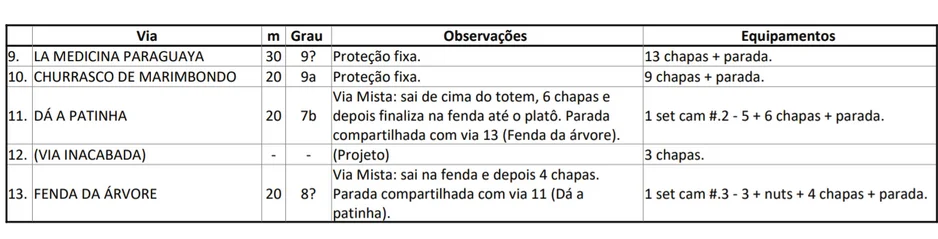
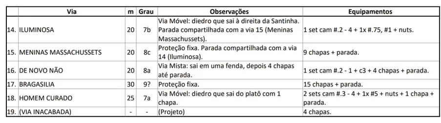
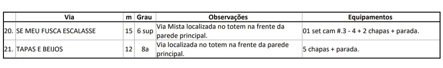

---
nome: Setor Principal
mapas:
- caminho_imagem_mapa: imagens/setor_principal_p0_i0.webp
  referencias:
  - escalada: Astro Rei
    ids:
    - '1'
  - escalada: Candelária
    ids:
    - '2'
  - escalada: Cabeça Feita
    ids:
    - '3'
  - escalada: Queijin Machine
    ids:
    - '4'
  - escalada: Dragão Chinês
    ids:
    - '5'
  - escalada: Kriptonita (1ª cordada)
    ids:
    - '6'
  - escalada: Via dos Alunos
    ids:
    - '7'
  - escalada: Via Inacabada
    ids:
    - '8'
  - escalada: La Medicina Paraguaya
    ids:
    - '9'
  - escalada: Churrasco de Marimbondo
    ids:
    - '10'
  - escalada: Dá a Patinha
    ids:
    - '11'
  - escalada: Via Inacabada
    ids:
    - '12'
  - escalada: Fenda da Árvore
    ids:
    - '13'
  - escalada: Iluminosa
    ids:
    - '14'
  - escalada: Meninas Massachussets
    ids:
    - '15'
  - escalada: De Novo Não
    ids:
    - '16'
  - escalada: Bragasilia
    ids:
    - '17'
  - escalada: Homem Curado
    ids:
    - '18'
  - escalada: Via Inacabada
    ids:
    - '19'
  - escalada: Se Meu Fusca Escalasse
    ids:
    - '20'
  - escalada: Tapas e Beijos
    ids:
    - '21'
  - escalada: Faca no Pescoço
    ids:
    - '22'
  - escalada: Para Com Isso
    ids:
    - '23'
  - escalada: Zé Patinha
    ids:
    - '24'
  - escalada: Mathilda Meu Amor
    ids:
    - '25'
escaladas:
- via_movel:
    nome: Astro Rei
    dificuldade: BR_7A
    extensao: 30
    quantidade_protecoes_intermediarias: 8
    quantidade_protecoes_parada: 1
    conquistadores:
    - Bruno Matta (Kbeça)
    descricao: 'Via Mista: Sai em uma fenda fina, depois 8 chapas + parada. Equipamentos: 1 set cam #.1-1 + set C3 + nuts pequenas.'
- via_movel:
    nome: Candelária
    dificuldade: BR_5
    extensao: 25
    conquistadores:
    - Bruno Matta (Kbeça)
    descricao: 'Via Móvel. Equipamentos: 1 jogo de friends #.4-5 + nuts + parada.'
- via_movel:
    nome: Cabeça Feita
    dificuldade: BR_7B
    extensao: 25
    quantidade_protecoes_intermediarias: 4
    quantidade_protecoes_parada: 1
    conquistadores:
    - Bruno Matta (Kbeça)
    descricao: 'Via Mista: sai em duas chapeletas. Equipamentos: 4 chapas + 1 set cam #.1-4 + parada.'
- via_multiplas_enfiadas:
    nome: Queijin Machine
    dificuldade_maxima: BR_7C_BARRA_8A
    comprimento_total: 60
    numero_enfiadas: 2
    conquistadores:
    - Bruno Matta (Kbeça)
    descricao: 'Via Mista (2 cordadas: 1ª cordada com 2 chapas, crux; 2ª cordada 100% em móvel 6 sup). Equipamentos: 2 sets de cam #0.3-3 + cam #4 e cam #5.'
- via_movel:
    nome: Dragão Chinês
    dificuldade: BR_7C
    extensao: 50
    conquistadores:
    - Bruno Matta (Kbeça)
    descricao: 'Via Móvel: Inicia-se escalando pela árvore para acessar o diedro (aprox. 8 metros). Rapel com 2 cordas de 50m. Equipamentos: 2 sets de cam #.5-4 + 1x #.3 #.4 #.5 + nuts.'
- via_movel:
    nome: Kriptonita (1ª cordada)
    dificuldade: BR_7C
    extensao: 32
    conquistadores:
    - Bruno Matta (Kbeça)
    descricao: 'Equipamentos: 2 jogos completos do #.3 ao 3 + adicional (1x #.75 + #1 + #2) + 1x #4.'
- via_esportiva:
    nome: Via dos Alunos
    dificuldade: PROJETO
    quantidade_protecoes_intermediarias: 6
    descricao: Projeto
- via_esportiva:
    nome: Via Inacabada
    dificuldade: PROJETO
    quantidade_protecoes_intermediarias: 3
    descricao: Projeto
- via_esportiva:
    nome: La Medicina Paraguaya
    dificuldade: BR_9A
    extensao: 30
    quantidade_protecoes_intermediarias: 13
    quantidade_protecoes_parada: 1
    conquistadores:
    - Bruno Matta (Kbeça)
    descricao: Proteção fixa. 13 chapas + parada.
- via_esportiva:
    nome: Churrasco de Marimbondo
    dificuldade: BR_9A
    extensao: 20
    quantidade_protecoes_intermediarias: 9
    quantidade_protecoes_parada: 1
    conquistadores:
    - Bruno Matta (Kbeça)
    descricao: Proteção fixa. 9 chapas + parada.
- via_movel:
    nome: Dá a Patinha
    dificuldade: BR_7B
    extensao: 20
    quantidade_protecoes_intermediarias: 6
    quantidade_protecoes_parada: 1
    conquistadores:
    - Bruno Matta (Kbeça)
    descricao: 'Via Mista: sai de cima do totem, 6 chapas e depois finaliza na fenda até o platô. Parada compartilhada com via 13 (Fenda da árvore). Equipamentos: 1 set cam #.2-5 + 6 chapas + parada.'
- via_esportiva:
    nome: Via Inacabada
    dificuldade: PROJETO
    quantidade_protecoes_intermediarias: 3
    descricao: Projeto
- via_movel:
    nome: Fenda da Árvore
    dificuldade: BR_8A
    extensao: 20
    quantidade_protecoes_intermediarias: 4
    quantidade_protecoes_parada: 1
    conquistadores:
    - Bruno Matta (Kbeça)
    descricao: 'Via Mista: sai na fenda e depois 4 chapas. Parada compartilhada com via 11 (Dá a patinha). Equipamentos: 1 set cam #.3-3 + nuts + 4 chapas + parada.'
- via_movel:
    nome: Iluminosa
    dificuldade: BR_7B
    extensao: 20
    conquistadores:
    - Bruno Matta (Kbeça)
    descricao: 'Via Móvel: diedro que sai à direita da Santinha. Parada compartilhada com a via 15 (Meninas Massachussets). Equipamentos: 1 set cam #.2-4 + 1x #.75, #1 + nuts.'
- via_esportiva:
    nome: Meninas Massachussets
    dificuldade: BR_8C
    extensao: 20
    quantidade_protecoes_intermediarias: 9
    quantidade_protecoes_parada: 1
    conquistadores:
    - Bruno Matta (Kbeça)
    descricao: Proteção fixa. Parada compartilhada com a via 14 (Iluminosa). 9 chapas + parada.
- via_movel:
    nome: De Novo Não
    dificuldade: BR_8A
    extensao: 20
    quantidade_protecoes_intermediarias: 4
    quantidade_protecoes_parada: 1
    conquistadores:
    - Bruno Matta (Kbeça)
    descricao: 'Via Mista: sai em uma fenda, depois 4 chapas até parada. Equipamentos: 1 set cam #.2-1 + c3 + 4 chapas + parada.'
- via_esportiva:
    nome: Bragasilia
    dificuldade: BR_9A
    extensao: 30
    quantidade_protecoes_intermediarias: 15
    quantidade_protecoes_parada: 1
    conquistadores:
    - Bruno Matta (Kbeça)
    descricao: Proteção fixa. 15 chapas + parada.
- via_movel:
    nome: Homem Curado
    dificuldade: BR_7A
    extensao: 25
    quantidade_protecoes_intermediarias: 1
    quantidade_protecoes_parada: 1
    conquistadores:
    - Bruno Matta (Kbeça)
    descricao: 'Via Móvel: diedro que sai do platô com 1 chapa. Equipamentos: 2 sets cam #.3-4 + 1x #5 + nuts + 1 chapa + parada.'
- via_esportiva:
    nome: Via Inacabada
    dificuldade: PROJETO
    quantidade_protecoes_intermediarias: 4
    descricao: Projeto
- via_movel:
    nome: Se Meu Fusca Escalasse
    dificuldade: BR_6SUP
    extensao: 15
    quantidade_protecoes_intermediarias: 2
    quantidade_protecoes_parada: 1
    conquistadores:
    - Bruno Matta (Kbeça)
    descricao: 'Via Mista localizada no totem na frente da parede principal. Equipamentos: 01 set cam #.3-4 + 2 chapas + parada.'
- via_esportiva:
    nome: Tapas e Beijos
    dificuldade: BR_8A
    extensao: 12
    quantidade_protecoes_intermediarias: 5
    quantidade_protecoes_parada: 1
    conquistadores:
    - Bruno Matta (Kbeça)
    descricao: Via localizada no totem na frente da parede principal. 5 chapas + parada.
- via_esportiva:
    nome: Faca no Pescoço
    dificuldade: BR_9A
    extensao: 20
    quantidade_protecoes_intermediarias: 12
    quantidade_protecoes_parada: 1
    conquistadores:
    - Bruno Matta (Kbeça)
    descricao: Proteção fixa. 12 chapas + parada.
- via_movel:
    nome: Para Com Isso
    dificuldade: BR_6_BARRA_6SUP
    extensao: 25
    quantidade_protecoes_intermediarias: 9
    quantidade_protecoes_parada: 1
    conquistadores:
    - Bruno Matta (Kbeça)
    descricao: 'Via Mista. 9 chapas + parada + 1 set cam #0.3 até o cam#2.'
- via_esportiva:
    nome: Zé Patinha
    dificuldade: BR_6SUP
    extensao: 25
    quantidade_protecoes_intermediarias: 9
    quantidade_protecoes_parada: 1
    conquistadores:
    - Bruno Matta (Kbeça)
    descricao: Proteção fixa. 9 chapas + parada (compartilhada com a via 23).
- via_esportiva:
    nome: Mathilda Meu Amor
    dificuldade: PROJETO
    descricao: Projeto
---

# Setor Principal

O Setor Principal da Pedra do Zé oferece uma grande variedade de vias, desde móveis clássicas até esportivas de alta dificuldade.

