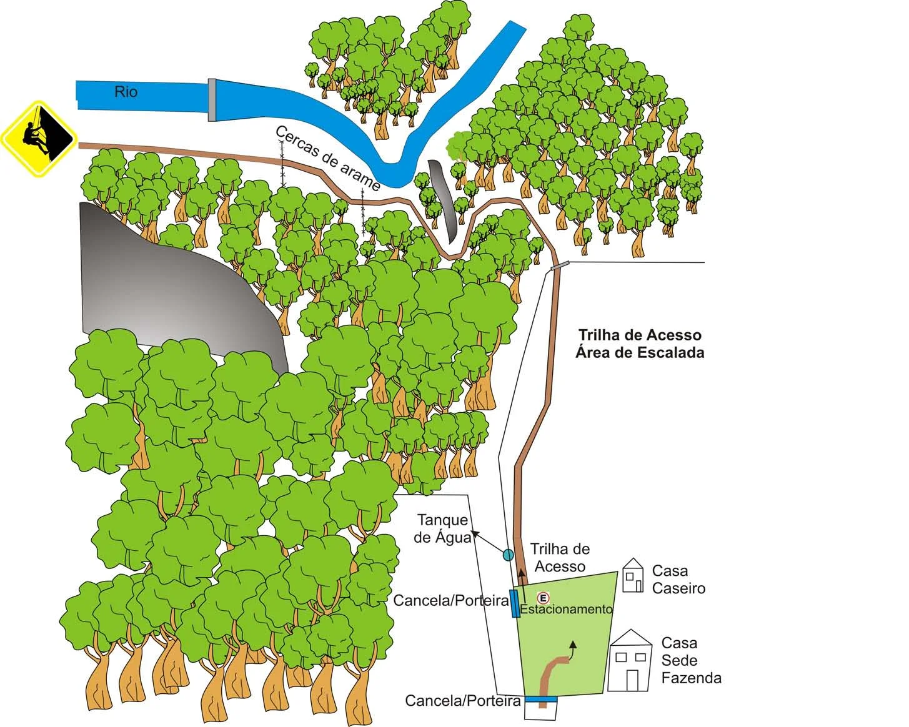

# Como chegar - FAZENDA ZUCULIN

Para chegar até aqui saindo de Montes Claros é necessário chegar até a avenida João 23 (avenida do hospital Aroldo Tourinho) e continuar até o trevo do distrito industrial. Após o trevo pegar reto sentido Fábrica de Cimento Lafarge em direção a Mirabela (ou Januária). Logo após a fábrica de cimento já estará na rodovia João Silva Maia. A partir de agora é só seguir até o Km 298, passando pela Polícia Militar Rodoviária.

# Trilha de Acesso - Área de Escalada

