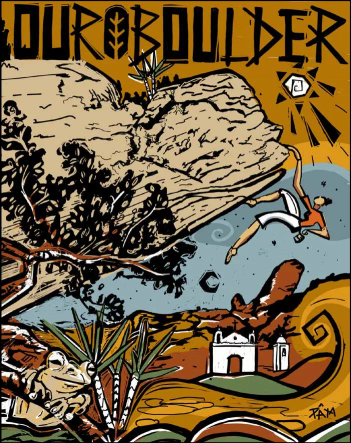

# A Artista e A Arte

Pâm Bergamini (1997, João Monlevade, MG) é multiartista independente e pesquisadora em arte. Residente em Ouro Preto, MG, desenvolve uma produção atravessada pelo corpo, pela memória, pela natureza e pelos processos artesanais, utilizando tintas naturais extraídas da terra como parte de sua pesquisa poética e visual.

Transita entre pintura, murais, fotografia, xilogravura, design e tatuagem, desenvolvendo projetos que unem arte, identidade visual e território. É autora da arte comemorativa dos 20 anos do evento Ouro Boulder, aplicada também na camisa oficial, com uma paleta inspirada em sua pesquisa com tintas de terra e na paisagem do Parque das Andorinhas. Moradora do bairro São Sebastião, onde o evento acontece, estabelece em seu trabalho uma relação direta entre criação, pertencimento e memória local.