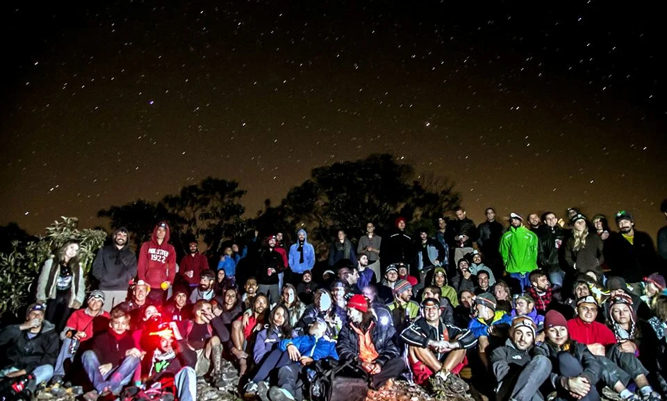

# Introdução

O Ouroboulder é um encontro de escaladores que acontece na cidade de Ouro Preto desde 2006. O grande potencial do pico reuniu atletas de todo país logo no primeiro ano, desde então faz parte do circuito de escaladores durante a alta temporada no Brasil.

## Linha do Tempo

- **2006**: 1º Festival Pico do Itacolomi
- **2007**: Descoberta Setor da Pedreira; Visita do espanhol Dani Andrada
- **2008... 2012**
- **2013**: Felipe Camargo cadena o Libertadores, o que seria o primeiro V14 do Brasil; 1º Croqui impresso do Brasil
- **2014**
- **2015**: 10 anos de Ouroboulder
- **2016... 2018**
- **2019**: O Japonês Jun Shibanuma manda o Libertadores de flash, decota para V13 e abre o Last Samurai V14
- **2020**: Primeiro ano sem festival (COVID-19); Descoberta do setor Sunset

*Registro durante a confraternização do Ouroboulder de 2013. Foto: Estúdio Buena Onda.*