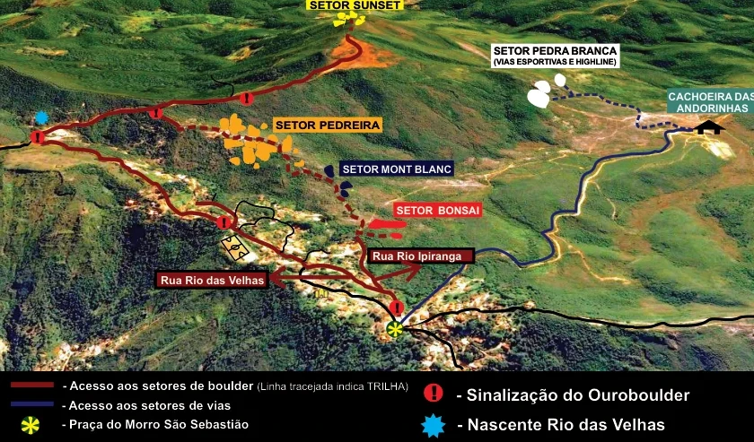

# Mapas Gerais

## Como Chegar

### Distâncias
- **São Paulo**: 628km
- **Rio de Janeiro**: 393km
- **Brasília**: 827km
- **Vitória**: 444km

### Em Ouro Preto
O principal setor de escalada é a Pedreira que se localiza no Morro São Sebastião. O acesso ao morro é através da Rua Henri Gorceix, uma íngreme e longa ladeira que se inicia ao lado esquerdo do antigo casarão da Escola de Minas, localizado na Praça Tiradentes. Ao final da ladeira, chega-se à praça principal do morro São Sebastião.

- **Linha Vermelha Contínua**: Acesso aos setores de boulder.
- **Linha Vermelha Tracejada**: Trilha.
- **Linha Azul**: Acesso aos setores de vias.
- **Estrela Amarela (*)**: Praça do Morro São Sebastião.
- **Círculo Azul (Nascente)**: Nascente Rio das Velhas.
- **Exclamação (!)**: Sinalização do Ouroboulder.