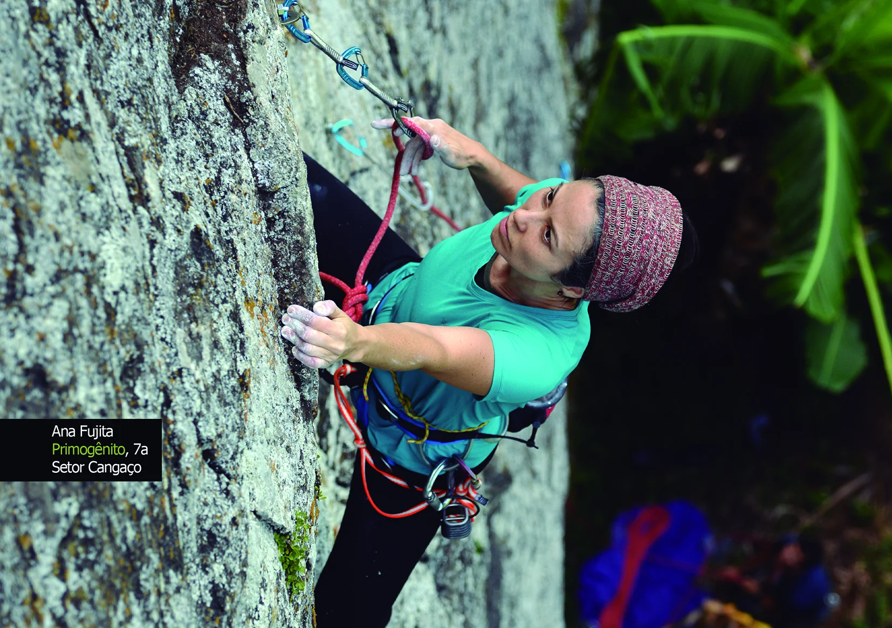

# Pedra da Divisa face MG

Seja bem-vindo à face mineira da Pedra da Divisa. Desejamos que você curta ao máximo este lugar e aproveite as escaladas antigas e recém abertas desta montanha.

As primeiras vias desta face, foram abertas nos anos 90. Após um longo período de esquecimento com raríssimas incursões, em janeiro de 2018, após permissão dos novos proprietários, resolvemos (Ana e Eliseu) dar um empurrão para o desenvolvimento destas paredes, o que em tempos de pandemia, se transformou rapidamente num dos points mais frequentados e populares da região.

Com o importante suporte dos nossos patrocinadores DEUTER, SOLO, SBI Outdoor. ROCX e SIMOND, mais o apoio da BONIER e ÂNCORA, pudemos em um curto espaço de tempo abrir as primeiras rotas esportivas nessas lindas paredes coloridas. No primeiro momento, estabelecemos o padrão de ancoragens, espaço entre vias e sistemas proteção, abrindo o caminho para a comunidade contribuir na abertura de novas linhas e na manutenção das já existentes, mantendo nossa comunidade motivada e diluindo o tráfego nas falésias e setores mais freqüentados da nossa região.

Na segunda fase de desenvolvimento, Carlos "Charlie" Alves, Antônio "Tonhão" Calvo e Leonard "Leo" Moreira contribuiram na abertura de mais de uma dezena de novas vias.

Este lugar, assim como outros, requer um bom entrosamento com os proprietários para que a porteira continue aberta para todos nós. Pedimos que você respeite as regras e ajude a fiscalizá-las.

## AQUI É PROIBIDO:

- Entrar com o carro no bananal. Estacione no pasto, antes da porteira de arame;
- Coletar bananas dos pés;
- Trazer animais;
- Fazer barulho em demasia;
- Acender qualquer tipo de fogo ou fogareiro;
- Acampar ou permanecer na área após as 18h00.

---

Ana Fujita
**Primogênito**, 7a
Setor Cangaço