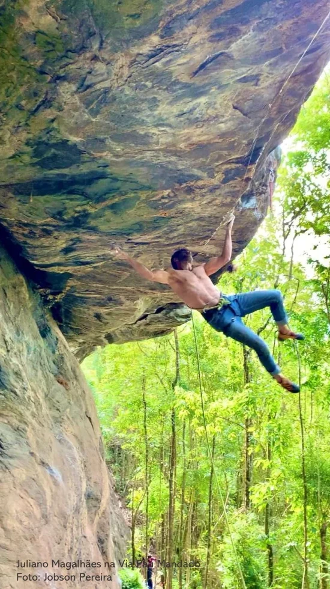

# APRESENTAÇÃO

A Gruta de Passa Vinte começou a se tornar um destinos dos amantes da escalada esportiva em Novembro de 2008, quando um grupo de amigos iniciaram as primeiras conquistas no local. Desde então, os trabalhos de abertura de novas vias se tornaram incessantes pela qualidade da rocha, negatividade das vias abrigadas das chuvas e acesso relativamente tranquilo, com uma caminhada de 20 a 30 minutos.

Atualmente, o setor possui aproximadamente 150 vias, com graduações que vão do IV a 11c, além de vários projetos de alto grau de dificuldade. Dentre essas rotas, há uma diversidade de estilos de escalada que tornam o local completo com vias verticais, negativas, positivas e tetos. A rocha predominante é o gnaisse que proporcionada uma diversidade de formações de agarras.

No inverno o sol demora um pouco mais para sair da parede, ficando no positivo central até por volta de 11h e no setor vertical da chegada até 13h. Já no verão, o sol sai do positivo central por volta das 9h e no vertical da chegada por volta das 11h. Assim, planeje os horários e setores da sua escalada se quer fugir do sol.