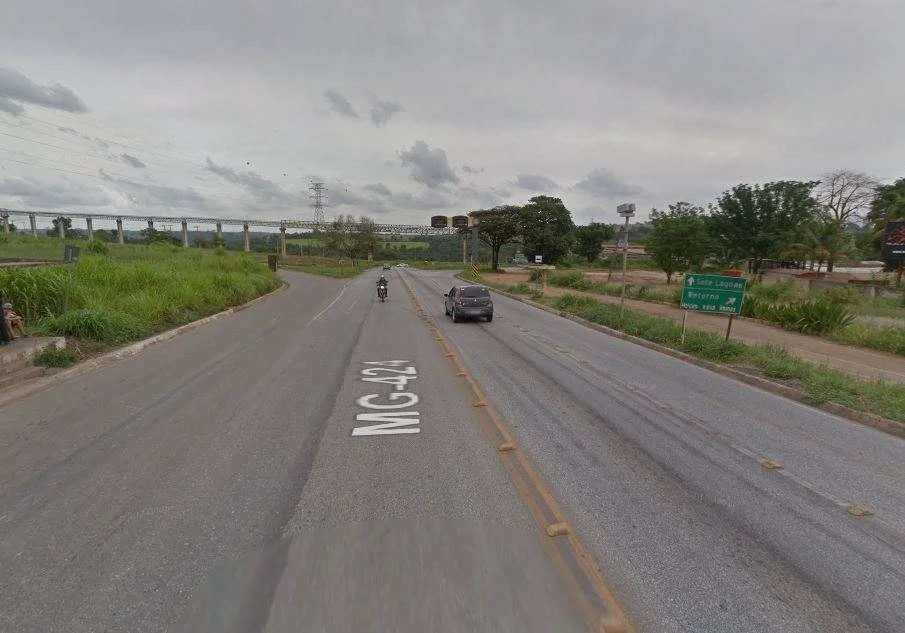

# Acesso

O Baú está localizado no município de Pedro Leopoldo, no distrito de Lagoa de Santo Antônio, há cerca de 50 km de Belo Horizonte.

Na saída de Belo Horizonte para o Aeroporto internacional de Confins (MG-010) entrar no trevo para a cidade de Pedro Leopoldo, seguindo pela MG 424. Após passar por Pedro Leopoldo continuar na rodovia em direção a Matozinhos e virar à direita no trevo da correia transportadora de minério que atravessa a estrada até o distrito de Lagoa de Santo Antônio.

Seguir em direção ao distrito de Fidalgo, passando próximo a uma lagoa e chegando até a Rua Pacífico Rodrigues.

**Coordenadas geográficas da entrada:** -19º33'12.5 -43º59'23.4

