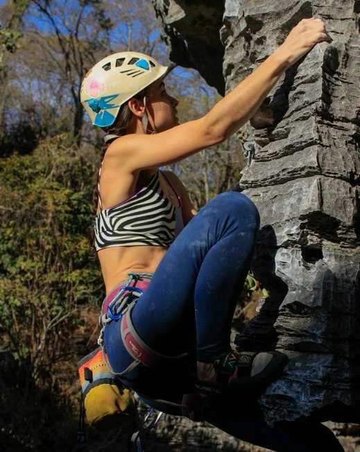

# História

O maciço do Baú está localizado no município de Pedro Leopoldo a cerca de 50 km de Belo Horizonte. O local está dentro dos limites da APA Carste de Lagoa Santa em uma propriedade particular, abrigando inúmeras cavernas e formações rochosas. Os espeleólogos encontraram nestas cavernas vários fósseis além de diversos espeleotemas de rara beleza.

O nome de Gruta do Baú advém da formação rochosa presente no maciço que se assemelha a uma fechadura.

O Baú começou a ser frequentado pelos escaladores na década de noventa, quando Roberto Lincoln e Rômulo Brandão, ambos recém formados em um curso de escalada, visitaram o local e perceberam o potencial deste, abrindo lá suas primeiras vias de escalada, hoje as clássicas “Retorno de Pitú” e “Sentinela”.

No princípio seus conhecimentos sobre conquistas e grampeações eram poucos, porém eles superaram esta falta de conhecimento e equipamentos adequados com uma boa dose de criatividade, conquistando diversas vias.

O proprietário atual é o empresário José Celso, um apaixonado pela natureza e por todo o complexo do Baú que preza pela boa convivência e faz de tudo para que os escaladores se sintam em casa ao frequentarem sua fazenda. Chegado a uma boa prosa, os encontros com ele sempre são recheados de boas histórias e risadas.