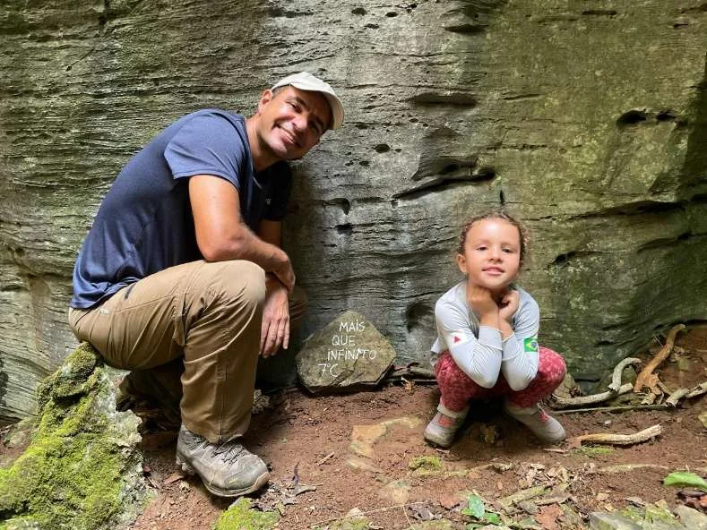
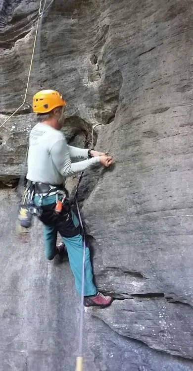

# Manutenção e conquista de novas vias

A grande maioria das vias do maciço do Baú são da década de 90, quase todas atingindo os 20 anos desde a conquista... Devido a idade das vias muitas proteções se deterioraram com o tempo e não se encontram em condições de utilização. Com o intuito de proporcionar uma escalada de qualidade e sobretudo segura, um pequeno grupo de escaladores locais está realizando de maneira gradativa a substituição das proteções e duplicando os top ropes.

Foi criado um grupo de trabalho em 2020 com o intuito de intermediar a abertura de novas vias junto ao proprietário. A abertura se dará de forma lenta e gradual, para diminuir os impactos gerados na área.

O GT Baú vem variando os membros ao longo do tempo e em agosto de 2025 é composto pelos escaladores: André Braga, Christian Costa, Igor Andrade, Iule Ornelas, Marcelo Novais, Márcio Vasconcelos, Roberto Lincoln, Sandro Almeida e Wilson Souza “Professor”.

