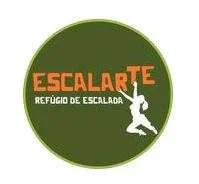

# Opções de Hospedagem

### Casa ou quartos para alugar na própria Gruta do Baú

O complexo da fazenda conta com uma casa que pode ser alugada por um grupo ou somente os quartos isoladamente. Fica bem ao lado da entrada e conta ainda com uma piscina privativa e deck panorâmico.
**CONTATOS**
Instagram: @grutadobau
WhatsApp - José Celso: (31) 98771-1655

### Rupestre da Lapa

Abrigo de escalada – Hospedagem com ou sem refeições, estacionamento, área de camping, quartos coletivos, duplos e suítes. Serve café da manhã, almoço, lanche e jantar mediante agendamento.
**CONTATOS**
Instagram: @hospedagemrupestredalapa
WhatsApp - Helon ou Denise: (31) 99807-8392

### Escalarte

Refúgio de escalada – Hospedagem a menos de 1 km da Gruta da Lapinha e 13 km da Gruta do Baú. Oferece quartos coletivos, duplos e suítes.

**CONTATOS**
Instagram: @escalar_te
WhatsApp – André Braga (Dedé): (31) 99831-3107